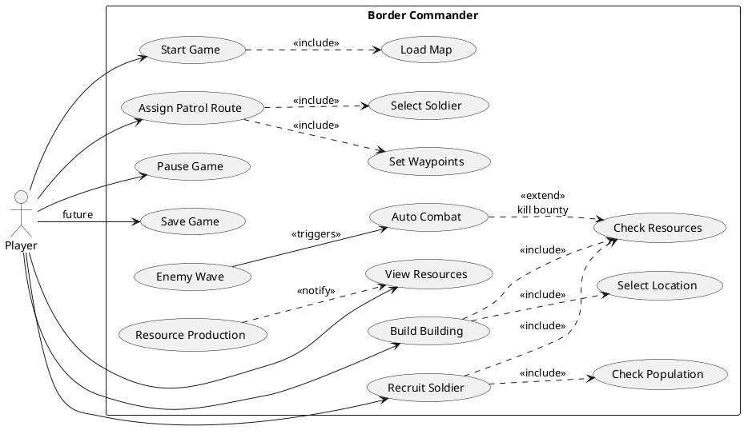
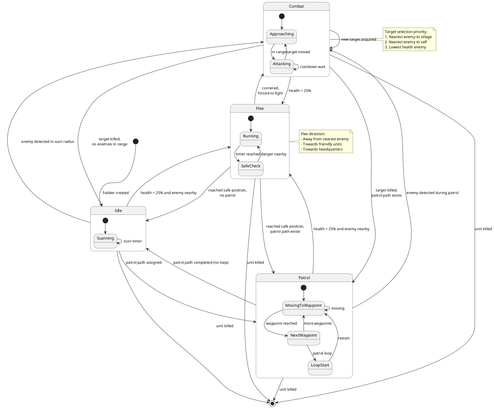
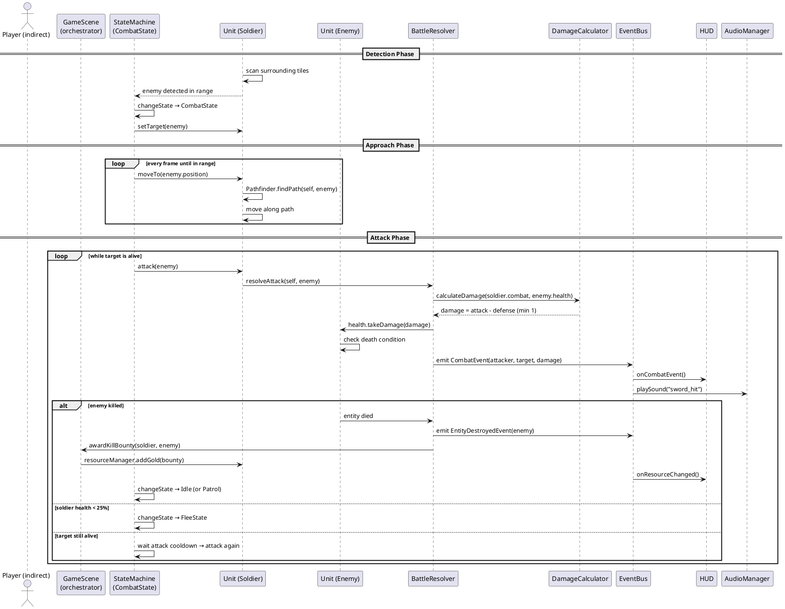
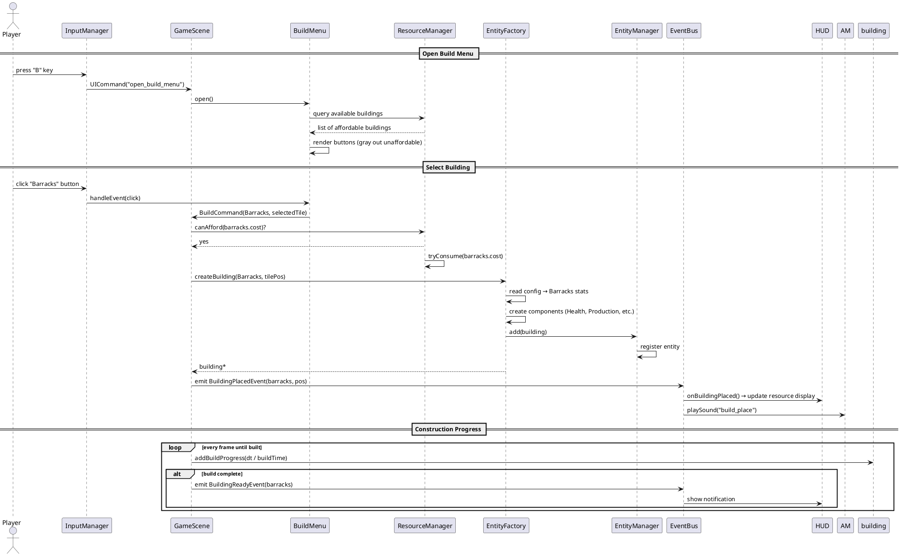

# Border Commander — Phase 2: 软件设计文档

> 文档版本：v2.0
> 创建日期：2026-07-03
> 阶段目标：完成全部软件设计，不编写任何代码
> 技术栈：C++20 / SFML 3.1.0 / Visual Studio 2022

---

## 目录

1. [Task 1 — 最终模块设计](#task-1-最终模块设计)
2. [Task 2 — 完整类设计](#task-2-完整类设计)
3. [Task 3 — 继承关系设计](#task-3-继承关系设计)
4. [Task 4 — 组合关系设计](#task-4-组合关系设计)
5. [Task 5 — UML 图表](#task-5-uml-图表)
6. [Task 6 — 设计模式](#task-6-设计模式)
7. [Task 7 — 模块通信与数据流](#task-7-模块通信与数据流)
8. [Task 8 — 职责边界](#task-8-职责边界)
9. [Task 9 — 项目风险分析](#task-9-项目风险分析)
10. [Task 10 — 最终设计审查](#task-10-最终设计审查)

---

## Task 1: 最终模块设计

### 1.0 v1.0 架构的批判性审查

在开始设计之前，先指出 v1.0 架构中存在的 5 个问题：

| # | 问题 | 严重性 | 修正方向 |
|---|------|--------|---------|
| 1 | **Manager 模块是"杂物抽屉"** — ResourceManager、InputManager、AudioManager、ConfigManager、SpawnManager 全塞在一起，缺乏内聚性 | 中 | 拆分 Resource 为独立模块，保持 Manager 只放"纯服务"类 |
| 2 | **缺少 Battle 模块** — 战斗逻辑散落在 CombatComponent 和 Unit 之间，没有统一的战斗系统 | 高 | 新增 Battle 模块，集中战斗结算、伤害计算、武器管理 |
| 3 | **AI ↔ Entity 潜在循环依赖** — v1.0 中 Unit 拥有 StateMachine（AI 模块），同时 AI 状态需要引用 Unit，两模块互相知道对方 | 高 | AI 只依赖 Entity，Entity 不依赖 AI。StateMachine 由 Scene 层注入 |
| 4 | **Animation 藏在 Graphics 内** — 帧动画是独立的逻辑系统，与底层渲染抽象不应混在一起 | 低 | Animation 独立为模块，Graphics 专注于渲染管线 |
| 5 | **没有 Component 独立模块** — Component 类散落在 Entity 模块中，没有形成清晰的数据层 | 中 | Component 数据定义集中在一个地方，Entity 只负责"组装" |

### 1.1 最终模块列表

经过审查后，最终确定 **12 个模块**：

```
1.  Core        — 应用程序入口、游戏循环、引擎生命周期
2.  Scene       — 场景抽象、场景管理、游戏场景编排
3.  Entity      — 游戏对象体系（Entity 基类、Unit、Building 等）
4.  Component   — 纯数据组件（位置、生命值、战斗属性等）
5.  AI          — 有限状态机、AI 状态、行为决策
6.  Battle      — 战斗结算、伤害计算、武器系统
7.  Animation   — 帧动画、动画状态管理
8.  UI          — 用户界面组件、HUD、菜单
9.  Manager     — 横切服务管理器（输入、音频、配置、生成）
10. World       — 网格地图、地形、寻路、相机
11. Resource    — 资源类型、资源池、经济系统
12. Event       — 事件总线、事件类型定义
13. Utils       — 工具类（随机数、日志、常量、数学辅助）
```

> **注**：v1.0 有 10 个模块。v2.0 增加到 13 个。变化：
> - 新增 `Component`（从 Entity 中分离数据组件）
> - 新增 `Battle`（从 Entity 中分离战斗逻辑）
> - 新增 `Animation`（从 Graphics 中独立）
> - 新增 `Resource`（从 Manager 中独立经济系统）
> - 移除 `Graphics`（SFML 直接渲染策略，见下文说明）
> - 移除 `Math`（SFML 已提供 sf::Vector2f 等类型，工具归入 Utils）

### 1.2 各模块详细说明

---

#### Module 1: Core

**为什么存在**：每个程序都需要入口和生命周期管理。Core 是"组装层"——它知道所有模块的存在，负责创建、初始化和销毁。Core 自身不包含任何游戏逻辑。

**负责什么**：
- 程序入口（`main()` 或 `Application::run()`）
- SFML 窗口创建和销毁
- 固定时间步长游戏循环
- 子系统初始化和销毁顺序
- 持有并调度 SceneManager

**不能负责什么**：
- 不包含任何游戏玩法逻辑
- 不直接操作 Entity
- 不处理 UI 事件
- 不管理资源

**依赖哪些模块**：所有 12 个模块（作为组装层，这是唯一允许"知道一切"的模块）

**被哪些模块依赖**：无。没有任何模块可以依赖 Core。

**公开接口**：Application（run、quit）、Game（update、render）、GameClock（deltaTime、FPS）

---

#### Module 2: Scene

**为什么存在**：游戏有多个"画面"（主菜单、游戏中、暂停、结算）。每个画面有不同的更新和渲染逻辑。Scene 模式让每个画面独立开发，通过 SceneManager 进行切换。

**负责什么**：
- 定义 Scene 抽象接口（onEnter、onExit、update、render、handleInput）
- 管理场景栈（push/pop，支持覆盖场景如暂停菜单）
- GameScene 编排游戏逻辑（协调 Entity、AI、Battle、World）
- MainMenuScene、PauseScene、GameOverScene 各自独立

**不能负责什么**：
- 不管理资源（由 Manager 模块负责）
- 不直接渲染（通过 UI 和 Entity 的 render 方法）
- 不处理底层输入（由 InputManager 负责，Scene 只接收处理后的命令）
- 不创建 Entity（由 EntityFactory 负责）

**依赖哪些模块**：Entity、AI、Battle、World、UI、Event、Manager、Resource

**被哪些模块依赖**：Core

**公开接口**：Scene（抽象基类，virtual onEnter/onExit/update/render/handleInput）、SceneManager（pushScene、popScene、switchTo、getCurrent）

---

#### Module 3: Entity

**为什么存在**：游戏中的所有"东西"（建筑、士兵、敌人）都需要一个统一的管理框架。Entity 模块定义游戏对象的类型体系和生命周期。

**负责什么**：
- Entity 抽象基类（唯一ID、激活状态、标签）
- Unit（可移动+可战斗的实体）和 Building（不可移动的实体）分支
- 具体实体类型：Soldier、Enemy、Headquarters、Barracks、Farm、GoldMine、Wall
- Entity 容器（EntityManager：增删查改、空间查询）
- 将 Component 组装到 Entity 上

**不能负责什么**：
- 不定义 Component 数据结构（由 Component 模块负责）
- 不执行战斗逻辑（由 Battle 模块负责）
- 不执行 AI 决策（由 AI 模块负责）
- 不加载资源（由 Manager 模块负责）
- **不拥有 StateMachine**（打破循环依赖，由 Scene 层注入）

**依赖哪些模块**：Component、World、Resource

**被哪些模块依赖**：Scene、AI、Battle

**公开接口**：Entity（getId、isActive、getComponent、addComponent、update、render）、EntityManager（add、remove、findById、findInRadius、getAll、updateAll）、各具体 Entity 子类

---

#### Module 4: Component

**为什么存在**：将"实体的属性数据"与"实体本身"分离。Component 是纯数据结构（POD 或接近 POD），不含复杂逻辑。这使得数据流清晰、序列化容易、System 可以按组件类型批量处理实体。

**负责什么**：
- 定义所有组件的纯数据结构
- Component 基类（类型标识）
- 具体组件：TransformComponent、RenderComponent、MovementComponent、HealthComponent、CombatComponent、ProductionComponent、InventoryComponent、CollisionComponent、AIContextComponent

**不能负责什么**：
- 不包含游戏逻辑（那是 System/Scene 的职责）
- 不执行更新（update 方法由 Entity 或 System 调用，Component 只是数据容器）
- 不持有其他模块的引用

**依赖哪些模块**：Resource（用于 ResourceCost）、Utils

**被哪些模块依赖**：Entity、AI、Battle、Scene

**公开接口**：各 Component 的数据字段和简单的访问方法。例如 HealthComponent（currentHP、maxHP、isAlive）、TransformComponent（position、rotation、scale）

---

#### Module 5: AI

**为什么存在**：AI 是游戏的核心亮点——所有单位的自主行为都由 AI 驱动。独立模块化便于测试、替换决策模型（FSM→行为树）、调试。

**负责什么**：
- IState 接口（enter、execute、exit）
- StateMachine（当前状态管理、状态转换）
- 具体状态：IdleState、PatrolState、CombatState、FleeState、MoveToState
- 定义 AICommand / Intent（单位的行为意图，如 AttackCommand、MoveCommand）
- 决策逻辑（何时切换状态）

**不能负责什么**：
- 不能直接修改 Entity 的 Component（通过 Entity 的公开方法操作）
- 不能执行战斗结算（由 Battle 模块负责）
- 不拥有 Unit（通过引用/指针使用）
- 不加载配置（由 ConfigManager 负责）

**依赖哪些模块**：Entity（通过 Entity 的公开接口操作单位）、World（寻路查询）、Utils

**被哪些模块依赖**：Scene

**关键设计**：AI 模块依赖 Entity 模块（单向），Entity 模块不依赖 AI 模块。StateMachine 由 GameScene 创建并注入到 Unit。这打破了 v1.0 的潜在循环依赖。

**公开接口**：IState、StateMachine（update、changeState、getCurrentStateName）、AICommand 系列

---

#### Module 6: Battle

**为什么存在**：v1.0 中战斗逻辑散落在 CombatComponent 和 Unit 之间，职责不清晰。独立 Battle 模块集中管理所有战斗相关逻辑：伤害计算、战斗结算、武器管理。

**负责什么**：
- 伤害计算公式（攻击力 - 防御力 / 护甲减免 / 暴击等）
- 战斗结算（两个 Unit 之间的一次攻击过程）
- Weapon 类（武器属性：伤害、范围、攻速、类型）
- 攻击冷却管理
- 死亡处理（通过 Event 通知）

**不能负责什么**：
- 不包含 AI 决策（AI 决定"要不要攻击"，Battle 只负责"攻击产生了什么结果"）
- 不处理移动
- 不渲染战斗特效

**依赖哪些模块**：Entity（读写 CombatComponent、HealthComponent）、Component、Event

**被哪些模块依赖**：Scene

**公开接口**：Weapon、DamageCalculator（calculateDamage）、BattleResolver（resolveAttack）、AttackResult

---

#### Module 7: Animation

**为什么存在**：帧动画有自己的数据模型（帧序列、时间间隔、循环模式）和播放逻辑，与底层渲染抽象不同。独立模块便于升级（骨骼动画、Spine 集成）。

**负责什么**：
- Animation 类（帧序列、帧间隔、循环/单次播放）
- AnimationManager（管理多个动画实例、更新播放进度）
- AnimationClip（命名的动画片段：idle、walk、attack、die）
- 帧更新逻辑

**不能负责什么**：
- 不负责纹理加载（由 ConfigManager / 资源系统负责）
- 不直接渲染（渲染由 Entity 的 RenderComponent 或 Renderer 负责，Animation 只提供当前帧的纹理区域）
- 不处理音频

**依赖哪些模块**：Utils（Timer）

**被哪些模块依赖**：Entity（RenderComponent 引用 Animation）、Scene

**公开接口**：Animation（addFrame、play、pause、stop、getCurrentFrame、isFinished）、AnimationManager（add、update、get）

---

#### Module 8: UI

**为什么存在**：玩家与游戏的交互全部通过 UI。UI 自成体系：层级结构、事件处理、布局管理。与游戏逻辑完全分离。

**负责什么**：
- UIElement 抽象基类（位置、大小、可见性、父子关系）
- 具体 UI 组件：Button、Label、Panel、ProgressBar、Image
- HUD（资源显示、选中信息、小地图）
- BuildMenu（建筑选择面板）
- UIManager（UI 元素管理、层级排序、事件分发）

**不能负责什么**：
- 不包含游戏逻辑（按钮点击发出事件，由 Scene 处理）
- 不管理资源（使用 Manager 模块的服务）
- 不执行建造（发出 BuildCommand 事件）

**依赖哪些模块**：Event、Manager（通过 ServiceLocator 获取资源数据）

**被哪些模块依赖**：Scene、Core

**公开接口**：UIElement、Button、Label、Panel、HUD、BuildMenu、UIManager

---

#### Module 9: Manager

**为什么存在**：横切关注点的集中管理。每个 Manager 只负责一个明确的服务。使用 ServiceLocator 注册和查找。

**负责什么**：
- InputManager：封装 SFML 输入，将原始事件映射为游戏命令
- AudioManager：音效和背景音乐播放（封装 SFML Audio）
- ConfigManager：加载 JSON 配置文件，提供类型安全的查询
- SpawnManager：敌人波次生成逻辑
- ServiceLocator：服务注册和查找容器

**不能负责什么**：
- 不包含游戏逻辑
- 不直接操作 Entity
- InputManager 不处理"这个按键在游戏中代表什么"（那是 Scene 的职责），只负责"这个按键被按下了"→ 游戏命令的映射

**依赖哪些模块**：Event、Resource、Utils（以及 SFML 第三方库）

**被哪些模块依赖**：Scene、UI、Entity、AI（通过 ServiceLocator 获取）

**公开接口**：各 Manager 的公开方法 + ServiceLocator::get<T>()、registerService<T>()

---

#### Module 10: World

**为什么存在**：2D 网格空间是策略游戏的基础。World 模块提供空间数据结构（Tile、TileMap）、空间查询（邻居、范围）、路径寻路和相机视口。

**负责什么**：
- Tile（地形类型、可行走性、占用状态）
- TileMap（二维网格、格子查询、范围查询、坐标转换）
- Pathfinder（A* 寻路算法）
- Camera（视口平移、缩放、世界坐标↔屏幕坐标转换）

**不能负责什么**：
- 不包含实体（实体存储在 Entity 模块中，Tile 只记录"被占用"状态）
- 不处理战斗
- 不渲染（Camera 提供 view 矩阵计算，但不执行 draw）

**依赖哪些模块**：Utils

**被哪些模块依赖**：Entity、AI、Scene、Battle

**公开接口**：Tile、TileMap、Pathfinder（findPath）、Camera（move、zoom、worldToScreen、screenToWorld）

---

#### Module 11: Resource

**为什么存在**：经济系统是策略游戏的核心。Resource 模块集中定义资源类型、资源池、交易（消费/收入）。与 Manager 分离是因为它是一个独立的领域概念，不只是一个"服务"。

**负责什么**：
- ResourceType 枚举定义（Gold、Food、Population）
- ResourcePool（每种资源的当前值、上限、变化率）
- ResourceTransaction（消费/收入的一次原子操作）
- 资源变更通知（通过 EventBus）

**不能负责什么**：
- 不控制"谁在消耗资源"（那是 Scene 和各系统的职责）
- 不控制建筑（建筑通过 ProductionComponent 定义产出，Resource 模块只管理数值）
- 不渲染 UI

**依赖哪些模块**：Event、Utils

**被哪些模块依赖**：Manager（ResourceManager）、Entity（ProductionComponent）、UI（HUD 显示）、Scene

**公开接口**：ResourceType、ResourcePool（get、add、tryConsume、canAfford）、ResourceTransaction

---

#### Module 12: Event

**为什么存在**：模块间松耦合通信的核心基础设施。所有跨模块通知都通过 EventBus，避免模块间直接调用。

**负责什么**：
- Event 基类（类型标识、时间戳）
- EventBus（订阅、取消订阅、同步发布、队列发布）
- 具体事件类型定义：
  - ResourceChangedEvent（资源类型、新值）
  - EntityCreatedEvent / EntityDestroyedEvent（实体ID、位置）
  - BuildingPlacedEvent（建筑类型、位置）
  - CombatEvent（攻击者、目标、伤害）
  - WaveStartEvent / WaveEndEvent（波次编号）
  - GameOverEvent（胜利/失败）
  - UICommandEvent（建造/招募/巡逻命令）

**不能负责什么**：
- 不包含业务逻辑
- 不保证事件被处理（fire-and-forget）
- 不存储事件历史（那是 Command 模式的可选附加功能）

**依赖哪些模块**：无（纯逻辑模块，零依赖）

**被哪些模块依赖**：几乎所有模块

**公开接口**：EventBus（subscribe、unsubscribe、emit、processQueue）、各 Event 子类

---

#### Module 13: Utils

**为什么存在**：零星的工具函数和类型需要一个归属。避免重复定义和"流浪函数"。

**负责什么**：
- Random（Mersenne Twister 随机数生成器封装）
- Logger（多级日志：DEBUG/INFO/WARN/ERROR，输出到控制台和文件）
- Timer（高精度计时器）
- Constants（游戏常量：地图大小、默认FPS等）
- 轻量数学辅助（如确实需要补充 SFML 的数学功能）

**不能负责什么**：
- 不包含任何游戏逻辑
- 不依赖任何游戏模块

**依赖哪些模块**：无

**被哪些模块依赖**：所有模块

**公开接口**：Random::range、Random::chance、Logger::info/warn/error、Timer::elapsed/reset、Constants 命名空间

---

### 1.3 依赖关系图

```
                           ┌──────────────────────┐
                           │        Core          │
                           │  (Assembly Layer)    │
                           └──────────┬───────────┘
                                      │ depends on everything
        ┌─────────────────────────────┼─────────────────────────────┐
        │                             │                             │
        ▼                             ▼                             ▼
┌───────────────┐           ┌───────────────────┐         ┌─────────────────┐
│    Scene      │           │     Manager       │         │       UI        │
│ (orchestrates │           │ (cross-cutting    │         │ (user interface │
│  gameplay)    │           │  services)        │         │  layer)         │
└───────┬───────┘           └─────────┬─────────┘         └────────┬────────┘
        │                             │                            │
   ┌────┴────┬──────────┬─────────┐   │                            │
   ▼         ▼          ▼         ▼   │                            │
┌──────┐ ┌──────┐ ┌──────────┐ ┌──────┐                            │
│Entity│ │  AI  │ │  Battle  │ │World │                            │
└──┬───┘ └──┬───┘ └────┬─────┘ └──┬───┘                            │
   │        │           │          │                                │
   ▼        ▼           ▼          ▼                                │
┌─────────────────────────────────────────┐                         │
│          Component  (Data Layer)        │◄────────────────────────┘
└─────────────────┬───────────────────────┘
                  │
      ┌───────────┴────────────┬──────────────┐
      ▼                        ▼              ▼
┌──────────┐           ┌────────────┐  ┌────────────┐
│ Resource │           │ Animation  │  │   Event    │
└────┬─────┘           └─────┬──────┘  └─────┬──────┘
     │                       │               │
     └───────────┬───────────┘               │
                 ▼                           │
          ┌────────────┐                     │
          │   Utils    │◄────────────────────┘
          └────────────┘
```

**依赖层级总结：**

```
Layer 3 (Assembly):     Core ──→ all
Layer 2 (Orchestration): Scene, UI, Manager ──→ Layer 1, 0
Layer 1 (Domain Logic):  Entity, AI, Battle, World ──→ Layer 0
Layer 0 (Foundation):    Component, Resource, Animation, Event, Utils
```

**关键约束：**
- Layer 0 之间只能互相依赖同层模块（如 Component → Resource）
- Layer 1 可以依赖 Layer 0
- Layer 2 可以依赖 Layer 1、Layer 0
- Layer 3 可以依赖所有层
- **禁止反向依赖**（Layer 0 不能依赖 Layer 1+）

### 1.4 通信流

```
玩家输入（键盘/鼠标）
    │
    ▼
InputManager  ← 将原始事件转化为 GameCommand
    │
    ▼
Scene.handleInput(command)
    │
    ├──→ 建造命令 → EntityManager.createBuilding(...) → EventBus.emit(BuildingPlacedEvent)
    ├──→ 招募命令 → EntityManager.createSoldier(...) → EventBus.emit(SoldierRecruitedEvent)
    └──→ 巡逻命令 → AIContextComponent.setPatrolPath(...)
    │
    ▼
Scene.update(dt)
    │
    ├──→ AI.StateMachine.update(unit, dt)  ← 扫描环境、决策状态转换、产生 AICommand
    │       │
    │       └──→ AttackCommand → Battle.resolveAttack(attacker, target)
    │       └──→ MoveCommand  → MovementComponent.setTarget(...)
    │
    ├──→ BattleSystem.update(dt)  ← 处理所有战斗中的单位
    │       └──→ CombatEvent → EventBus.emit(...)
    │
    ├──→ World.TileMap.update(...)  ← 更新地块状态
    │
    ├──→ ResourceManager.update(dt)  ← 生产建筑产出资源
    │       └──→ ResourceChangedEvent → EventBus.emit(...)
    │
    └──→ SpawnManager.update(dt)  ← 检查是否需要生成新敌人波次
            └──→ WaveStartEvent → EventBus.emit(...)
    │
    ▼
EventBus.processQueue()  ← 分发所有累积事件
    │
    ├──→ HUD.onResourceChanged(...)  ← UI 更新资源显示
    ├──→ AudioManager.onCombatEvent(...) ← 播放战斗音效
    └──→ Scene.onEntityDestroyed(...) ← 检查胜利/失败条件
    │
    ▼
Scene.render(window)
    │
    ├──→ World.render(tileMap, camera)       ← 渲染地图
    ├──→ EntityManager.renderAll(window)     ← 渲染所有实体
    ├──→ Battle.renderEffects(window)        ← 渲染战斗特效
    └──→ UIManager.render(window)            ← 渲染 UI（最上层）
```

### 1.5 设计优势

| 优势 | 说明 |
|------|------|
| **单向依赖** | 没有循环依赖。依赖总是从高层流向低层 |
| **高内聚** | 每个模块只做一件事：AI 只管决策，Battle 只管结算 |
| **低耦合** | 模块间通过 EventBus 和 ServiceLocator 通信，减少直接依赖 |
| **可测试** | AI、Battle、Resource 等核心模块可以独立单元测试（不依赖 SFML 窗口） |
| **可扩展** | 新增兵种 = 新增 Entity 子类 + 新增配置；新增 AI 行为 = 新增 State 子类 |
| **数据驱动** | Component 是纯数据，易于序列化；配置存储在 JSON 中 |

### 1.6 未来扩展预留

| 扩展方向 | 涉及模块 | 方式 |
|---------|---------|------|
| 多兵种 | Entity + Component + Resource | 新增 Soldier 子类，读取不同配置 |
| 远程攻击 | Battle + Component | Weapon 增加 range 属性，新增 Projectile 类 |
| 科技树 | Resource + Manager | TechnologyManager + TechConfig |
| 存档/读档 | 所有 Component | Component 序列化/反序列化接口 |
| 联网对战 | Core + Scene | 新增 NetworkManager，Scene 接收网络命令 |
| 行为树 AI | AI | 替换 StateMachine 为 BehaviorTree，IState 接口兼容 |
| 多语言 | UI | 字符串表加载，Label 支持动态替换 |
| 粒子特效 | 新增 VFX 模块 | 独立模块，通过 Event 触发粒子播放 |

---

## Task 2: 完整类设计

以下列出项目中每一个类的完整设计。不写代码、不写参数类型、不写实现。

---

### 2.1 Core 模块

---

#### Application

**职责**：程序入口封装。创建 SFML 窗口、初始化 Engine、启动 Game 循环。
**为什么存在**：让 `main()` 只有 3 行代码。隔离 SFML 初始化细节。
**成员变量**：m_window、m_engine、m_game
**主要函数**：run、quit、getWindow
**依赖**：Engine、Game、SFML

---

#### Engine

**职责**：子系统生命周期管理。按顺序初始化/销毁所有 Manager，注册 ServiceLocator。
**为什么存在**：避免 Game 类中堆砌初始化代码。初始化顺序错误是常见 Bug。
**成员变量**：m_serviceLocator、m_initialized
**主要函数**：initialize、shutdown、getServiceLocator
**依赖**：ServiceLocator、所有 Manager 类

---

#### Game

**职责**：游戏主循环。管理帧率、协调 SceneManager 的 update/render。
**为什么存在**：将"游戏循环机制"与"游戏逻辑"分离。Game 只管"何时更新"，Scene 决定"更新什么"。
**成员变量**：m_sceneManager、m_clock、m_isRunning、m_fpsCounter
**主要函数**：run、update、render、processEvents、quit
**依赖**：SceneManager、GameClock、SFML RenderWindow

---

#### GameClock

**职责**：时间测量。提供 deltaTime、帧率计算、固定步长累计器。
**为什么存在**：将时间逻辑从 Game 中分离。便于测试时间相关功能。
**成员变量**：m_deltaTime、m_totalTime、m_fps、m_lag、m_fixedDt
**主要函数**：update、getDeltaTime、getFPS、isFixedUpdateReady、consumeFixedUpdate
**依赖**：SFML Clock

---

### 2.2 Scene 模块

---

#### Scene（抽象基类）

**职责**：定义场景生命周期接口。
**为什么存在**：所有具体场景的多态基类。SceneManager 只依赖此接口。
**成员变量**：m_sceneId、m_isActive
**主要函数**：onEnter（纯虚）、onExit（纯虚）、update（纯虚）、render（纯虚）、handleInput（纯虚）、isActive
**依赖**：无

---

#### SceneManager

**职责**：管理场景栈（Scene Stack），处理场景切换请求。
**为什么存在**：支持 push/pop 场景（暂停菜单覆盖游戏场景），而非简单替换。
**成员变量**：m_sceneStack、m_pendingOperations
**主要函数**：pushScene、popScene、switchTo、update、render、handleInput
**依赖**：Scene

---

#### GameScene

**职责**：游戏主场景。编排所有游戏子系统的 update/render 顺序。
**为什么存在**：游戏逻辑的"指挥中心"。所有子系统在此协调。
**成员变量**：m_entityManager、m_tileMap、m_camera、m_hud、m_spawnManager、m_resourceManager、m_aiControllers（StateMachine 的容器）
**主要函数**：onEnter（加载地图、初始化实体）、onExit（清理）、update（调用 AI→Battle→World→Resource 更新链）、render、handleInput（分发命令）
**依赖**：几乎所有 Layer 1 和 Layer 2 模块

---

#### MainMenuScene

**职责**：主菜单画面。显示"开始游戏"、"退出"按钮。
**成员变量**：m_uiManager、m_background
**主要函数**：onEnter、update、render、handleInput
**依赖**：UI

---

#### PauseScene

**职责**：暂停菜单。覆盖在 GameScene 之上（push，不 pop）。
**成员变量**：m_uiManager
**主要函数**：onEnter、render、handleInput
**依赖**：UI

---

#### GameOverScene

**职责**：结算画面。显示胜负结果。
**成员变量**：m_result（胜利/失败）、m_stats（击杀数、存活波次）、m_uiManager
**主要函数**：onEnter（接收结算数据）、render、handleInput
**依赖**：UI

---

### 2.3 Entity 模块

---

#### Entity（抽象基类）

**职责**：所有游戏对象的共同基类。持有唯一ID、激活标志、组件容器。
**为什么存在**：统一管理和遍历所有游戏对象。
**成员变量**：m_id、m_isActive、m_tag、m_components（Component 的映射/向量）
**主要函数**：getId、isActive、setActive、getComponent<T>、addComponent、hasComponent、update（虚函数）、render（虚函数）
**依赖**：Component

---

#### EntityManager

**职责**：Entity 的容器。提供增删查改和空间查询。
**为什么存在**：集中管理实体生命周期——创建、销毁、按类型/位置/ID 查找。
**成员变量**：m_entities、m_pendingAdd、m_pendingRemove、m_nextId
**主要函数**：add、remove、findById、findByTag、findInRadius、getAll、updateAll、renderAll、processPending
**依赖**：Entity、World（用于空间查询）

---

#### EntityFactory

**职责**：Entity 创建的工厂。从配置读取属性，组装 Component。
**为什么存在**：集中创建逻辑。确保实体创建后 Component 完整、ID 唯一。
**成员变量**：m_configManager 引用、m_entityManager 引用
**主要函数**：createSoldier、createEnemy、createBuilding、destroyEntity
**依赖**：EntityManager、ConfigManager、Component

---

#### Unit（继承 Entity）

**职责**：可移动、可战斗的游戏对象基类。
**为什么存在**：Soldier 和 Enemy 的公共父类。封装移动和战斗的接口调用。
**成员变量**：（通过 Component 存储，不直接持有数据）
**主要函数**：moveTo、attack、takeDamage、heal、isAlive、getPosition、getTeam、setTeam
**依赖**：Component（MovementComponent、CombatComponent、HealthComponent、TransformComponent）

---

#### Soldier（继承 Unit）

**职责**：玩家阵营的士兵单位。
**为什么存在**：与 Enemy 区分阵营。玩家的间接控制对象。
**成员变量**：m_patrolPath（巡逻路径点列表）、m_cost（招募消耗）
**主要函数**：setPatrolPath、getPatrolPath、getRecruitCost
**依赖**：Unit

---

#### Enemy（继承 Unit）

**职责**：敌人阵营的单位。
**为什么存在**：与 Soldier 区分阵营。AI 行为不同（总是主动进攻村庄）。
**成员变量**：m_waveNumber（所属波次）、m_bounty（击杀奖励金币）
**主要函数**：getWaveNumber、getBounty
**依赖**：Unit

---

#### Building（继承 Entity）

**职责**：不可移动的游戏对象基类。
**为什么存在**：区别于 Unit——不能移动，有建造进度，有占地大小。
**成员变量**：m_buildProgress、m_buildTime、m_tileSize（占用格子数，如 2x2）
**主要函数**：isBuilt、getBuildProgress、addBuildProgress、getOccupiedTiles、getCost
**依赖**：Entity、Component（ProductionComponent）

---

#### Headquarters（继承 Building）

**职责**：指挥部。初始建筑，被摧毁则游戏失败。
**为什么存在**：胜利/失败条件的锚点。
**成员变量**：（继承 Building）
**主要函数**：onDestroyed（发出 GameOverEvent）
**依赖**：Building

---

#### Barracks（继承 Building）

**职责**：兵营。可招募士兵。提供招募队列。
**为什么存在**：兵力来源。
**成员变量**：m_recruitQueue（招募队列）、m_recruitProgress
**主要函数**：queueRecruit、getRecruitProgress、getAvailableTypes
**依赖**：Building

---

#### Farm（继承 Building）

**职责**：农场。产出食物。
**为什么存在**：食物来源，支撑人口上限。
**成员变量**：m_foodPerMinute
**主要函数**：getProductionRate
**依赖**：Building、ProductionComponent

---

#### GoldMine（继承 Building）

**职责**：金矿。产出金币。
**为什么存在**：金币来源，经济基础。
**成员变量**：m_goldPerMinute
**主要函数**：getProductionRate
**依赖**：Building、ProductionComponent

---

#### Wall（继承 Building）

**职责**：城墙。阻挡敌人移动，无产出。
**为什么存在**：防御性建筑，改变地形可行走性。
**成员变量**：m_defenseBonus（给后方单位的防御加成）
**主要函数**：getDefenseBonus
**依赖**：Building

---

### 2.4 Component 模块

---

#### Component（基类）

**职责**：所有组件的抽象基类。提供类型标识。
**为什么存在**：允许 Entity 以统一方式存储和查询不同类型的 Component。
**成员变量**：m_typeId、m_owner（Entity 引用）
**主要函数**：getTypeId、getOwner
**依赖**：无

---

#### TransformComponent

**职责**：存储实体的空间信息。
**成员变量**：position（世界坐标）、rotation、scale
**主要函数**：getPosition、setPosition、move
**依赖**：无

---

#### RenderComponent

**职责**：定义实体的外观。
**成员变量**：spriteId、renderLayer、colorModulation、animationRef（Animation 引用）、visible
**主要函数**：setSprite、setAnimation、getCurrentFrame、setVisible
**依赖**：Animation

---

#### MovementComponent

**职责**：定义可移动实体的移动参数。
**成员变量**：speed、targetPosition、path（路径点队列）、isMoving
**主要函数**：setTarget、clearPath、getNextWaypoint、hasArrived
**依赖**：Utils

---

#### HealthComponent

**职责**：定义实体的生命值。
**成员变量**：currentHP、maxHP、armor、isDead
**主要函数**：takeDamage、heal、isAlive、getHealthPercent
**依赖**：无

---

#### CombatComponent

**职责**：定义实体的战斗属性。
**成员变量**：attackDamage、attackRange、attackCooldown、currentCooldown、weapon（Weapon 引用）、isInCombat
**主要函数**：canAttack、startCooldown、getWeapon
**依赖**：Battle（Weapon）

---

#### ProductionComponent

**职责**：定义建筑的资源产出。
**成员变量**：produces（ResourceType）、rate（每秒产量）、accumulator（累计器）
**主要函数**：getProduction、accumulate、canProduce
**依赖**：Resource

---

#### InventoryComponent

**职责**：定义单位的物品栏（可选，用于扩展）。
**成员变量**：items（向量）、capacity
**主要函数**：addItem、removeItem、hasItem、isFull
**依赖**：无

---

#### CollisionComponent

**职责**：定义实体的碰撞体积。
**成员变量**：bounds（AABB 矩形）、isTrigger（是否只触发不阻挡）、layer（碰撞层）
**主要函数**：getBounds、intersects、setBounds
**依赖**：无

---

#### AIContextComponent

**职责**：存储 AI 相关的上下文数据（但不包含 StateMachine 实例）。
**为什么存在**：Entity 模块不依赖 AI 模块的关键——AI 需要的数据由 Component 存储，StateMachine 由 Scene 层注入。
**成员变量**：patrolPath、guardPosition、alertRadius、currentCommand（AICommand 的变体，此处用轻量枚举）
**主要函数**：setPatrolPath、setGuardPosition、setCommand、getCommand
**依赖**：无

---

### 2.5 AI 模块

---

#### IState（接口）

**职责**：定义 AI 状态接口。
**为什么存在**：状态模式的核心抽象。所有具体状态实现此接口。
**成员变量**：无（纯接口）
**主要函数**：enter（纯虚）、execute（纯虚）、exit（纯虚）、getStateName（纯虚）
**依赖**：无

---

#### StateMachine

**职责**：管理当前状态和执行状态转换。
**为什么存在**：封装 FSM 逻辑。被 Scene 层持有，每帧调用 update 驱动 AI。
**成员变量**：m_currentState、m_previousState、m_owner（Unit 引用）、m_blackboard（状态间共享数据）
**主要函数**：update、changeState、getCurrentState、revertToPreviousState
**依赖**：IState、Entity（Unit）

---

#### IdleState

**职责**：空闲状态。原地等待，周期性扫描周围敌人。
**为什么存在**：单位的默认状态。没有命令时进入。
**成员变量**：m_scanTimer、m_scanInterval
**主要函数**：enter、execute（扫描敌人→发现则转为 CombatState）、exit
**依赖**：IState、Entity（Unit）、World（空间查询）

---

#### PatrolState

**职责**：巡逻状态。沿设定的路径点移动。
**为什么存在**：玩家指派巡逻任务后的状态。
**成员变量**：m_patrolIndex、m_waitTimer
**主要函数**：enter、execute（移动→到达则下一个路点/循环→发现敌人转为 CombatState）、exit
**依赖**：IState、Entity（Unit）、World

---

#### CombatState

**职责**：战斗状态。追踪目标、移动到攻击范围、执行攻击。
**为什么存在**：单位遇见敌人后的自主战斗行为。
**成员变量**：m_target（Entity 引用）、m_attackTimer
**主要函数**：enter、execute（追敌→攻击→目标死亡则回 Idle→自己血量低则转 FleeState）、exit
**依赖**：IState、Entity（Unit）、Battle

---

#### FleeState

**职责**：逃跑状态。向远离敌人的方向移动。
**为什么存在**：提高单位生存率。血量过低时触发。
**成员变量**：m_fleeDirection、m_fleeTimer
**主要函数**：enter、execute（移动→安全后回 Idle 或巡逻）、exit
**依赖**：IState、Entity（Unit）、World

---

#### MoveToState

**职责**：移动到目标位置的通用状态。
**为什么存在**：被其他状态复用的移动逻辑。
**成员变量**：m_targetPosition、m_arrivedCallback
**主要函数**：enter、execute（沿路径移动→到达后回调）、exit
**依赖**：IState、Entity（Unit）、World（Pathfinder）

---

### 2.6 Battle 模块

---

#### Weapon

**职责**：武器数据对象。定义武器属性。
**为什么存在**：武器从 Unit 中独立出来，支持不同兵种装备不同武器。
**成员变量**：damage、range、attackSpeed、type（近战/远程）、name
**主要函数**：getDamage、getRange、getType
**依赖**：无

---

#### DamageCalculator

**职责**：伤害计算公式。
**为什么存在**：集中伤害计算逻辑。公式变更时只修改一个地方。
**成员变量**：（状态 — 可能包含全局伤害倍率）
**主要函数**：calculateDamage（攻击者 CombatComponent + 防御者 HealthComponent → 实际伤害值）
**依赖**：Component

---

#### BattleResolver

**职责**：执行一次完整的攻击结算。
**为什么存在**：协调"单位A攻击单位B"的完整流程：检查冷却→计算伤害→扣除生命→发出事件→检查死亡。
**成员变量**：（无状态，可设计为纯函数/静态方法）
**主要函数**：resolveAttack（攻击者 Entity、目标 Entity → AttackResult）、resolveDeath（Entity → 发出 EntityDestroyedEvent）
**依赖**：Entity、Component、DamageCalculator、Event

---

#### AttackResult

**职责**：存储一次攻击的结果数据。
**为什么存在**：纯数据结构，用于事件传递和日志。
**成员变量**：attacker、target、damageDealt、isKill、isCritical
**主要函数**：（纯 getter）
**依赖**：无

---

### 2.7 Animation 模块

---

#### AnimationClip

**职责**：命名的动画片段（idle、walk、attack、die）。
**为什么存在**：将动画数据组织为逻辑单元。
**成员变量**：name、frames（Frame 的向量）、loop、durationPerFrame
**主要函数**：getFrameCount、getDuration、isLooping
**依赖**：无

---

#### Animation

**职责**：动画播放器。管理当前播放状态。
**为什么存在**：将动画播放逻辑与渲染分离。
**成员变量**：m_clips（AnimationClip 的映射）、m_currentClip、m_currentFrame、m_timer、m_isPlaying
**主要函数**：play、stop、pause、resume、update、getCurrentTextureRect、isFinished
**依赖**：AnimationClip、Utils（Timer）

---

#### AnimationManager

**职责**：管理所有活跃的 Animation 实例。
**为什么存在**：集中更新所有动画。避免每个 Entity 各自管理。
**成员变量**：m_animations（Animation 的映射，按 ID 索引）
**主要函数**：create、destroy、updateAll、get
**依赖**：Animation

---

#### Frame

**职责**：单帧数据。纹理区域引用和持续时间。
**为什么存在**：AnimationClip 的基本组成单元。
**成员变量**：textureRect、duration
**主要函数**：（纯数据结构，getter）
**依赖**：无

---

### 2.8 UI 模块

---

#### UIElement（抽象基类）

**职责**：UI 组件基类。位置、大小、可见性、父子关系。
**为什么存在**：统一 UI 接口，支持构建 UI 层级树。
**成员变量**：m_position、m_size、m_visible、m_parent、m_children
**主要函数**：render（纯虚）、handleEvent（虚）、setPosition、setSize、isVisible、addChild
**依赖**：无

---

#### Button（继承 UIElement）

**职责**：可点击按钮。支持文字或图标。
**为什么存在**：玩家交互的主要方式。
**成员变量**：m_label、m_onClick（回调）、m_isHovered、m_isPressed
**主要函数**：render、handleEvent、setOnClick、setText
**依赖**：UIElement

---

#### Label（继承 UIElement）

**职责**：文本显示。支持字体、颜色、对齐。
**为什么存在**：资源数值、单位名称、提示文字的显示。
**成员变量**：m_text、m_fontSize、m_color、m_alignment
**主要函数**：render、setText、getText
**依赖**：UIElement

---

#### Panel（继承 UIElement）

**职责**：矩形面板，可作为子元素的容器。
**为什么存在**：菜单背景、信息面板、分组框。
**成员变量**：m_backgroundColor、m_borderColor、m_padding
**主要函数**：render、addChild、removeChild
**依赖**：UIElement

---

#### ProgressBar（继承 UIElement）

**职责**：进度条。显示建造进度、血量等。
**为什么存在**：可视化数值比例。
**成员变量**：m_value、m_maxValue、m_fillColor、m_backgroundColor
**主要函数**：render、setValue、setMaxValue
**依赖**：UIElement

---

#### HUD（继承 UIElement）

**职责**：游戏内抬头显示。管理资源条、选中信息、小地图。
**为什么存在**：游戏界面的主 UI 层，所有游戏状态的可视化。
**成员变量**：m_resourceLabels、m_selectedInfo、m_waveIndicator、m_buildMenu
**主要函数**：render、onResourceChanged（事件回调）、onEntitySelected、showBuildMenu、hideBuildMenu
**依赖**：UIElement、BuildMenu、Event

---

#### BuildMenu（继承 UIElement）

**职责**：建筑选择面板。列出可建造建筑及其资源消耗。
**为什么存在**：玩家建造建筑的主要界面。
**成员变量**：m_buildingButtons、m_isOpen、m_buildingConfigs
**主要函数**：render、handleEvent、open、close、refreshAvailability（检查资源是否足够）
**依赖**：UIElement、Button、Resource

---

#### UIManager

**职责**：所有 UI 元素的管理和渲染调度。
**为什么存在**：集中管理 UI 的添加、移除、层级排序、事件分发。
**成员变量**：m_rootElements、m_focusElement
**主要函数**：addElement、removeElement、renderAll、dispatchEvent、setFocus
**依赖**：UIElement

---

### 2.9 Manager 模块

---

#### InputManager

**职责**：封装 SFML 原始输入事件，转换为高层游戏命令。
**为什么存在**：解耦物理输入与游戏逻辑。测试时可直接注入命令而不需要真实的按键。
**成员变量**：m_keyBindings、m_commandQueue
**主要函数**：processEvents、mapKeyToCommand、getPendingCommands、bindKey、loadBindings
**依赖**：SFML

---

#### AudioManager

**职责**：音效和背景音乐播放。
**为什么存在**：封装 SFML Audio API。集中管理音频资源。
**成员变量**：m_soundBuffers、m_music、m_volume、m_muted
**主要函数**：playSound、playMusic、stopMusic、setVolume、loadSound、onEvent（订阅 EventBus）
**依赖**：SFML Audio、Event

---

#### ConfigManager

**职责**：加载和管理 JSON 配置文件。
**为什么存在**：数据驱动设计的核心。避免属性硬编码在 C++ 中。
**成员变量**：m_configs（JSON 对象的映射）
**主要函数**：loadConfig、getBuildingConfig、getUnitConfig、getWaveConfig、reload
**依赖**：无（或 JSON 解析库如 nlohmann/json）

---

#### SpawnManager

**职责**：敌人波次生成管理。
**为什么存在**：波次系统的核心。控制生成时机、位置、数量和类型。
**成员变量**：m_waveConfigs、m_currentWave、m_waveTimer、m_spawnQueue、m_gameSceneRef
**主要函数**：update、startNextWave、spawnEnemy、isWaveActive、getRemainingEnemies
**依赖**：Entity（EntityFactory）、World、Event、ConfigManager

---

#### ServiceLocator

**职责**：全局服务注册和查找容器。
**为什么存在**：替代 Singleton。便于测试时替换服务实现。
**成员变量**：m_services（类型到服务实例的映射）
**主要函数**：registerService、get<T>、has<T>、clear
**依赖**：无

---

### 2.10 World 模块

---

#### Tile

**职责**：单个地图格子的数据。
**为什么存在**：地图的最小空间单元。
**成员变量**：terrainType（Grass、Dirt、Water、Mountain）、walkable、occupied、occupantRef
**主要函数**：isWalkable、isOccupied、setOccupied
**依赖**：无

---

#### TileMap

**职责**：二维网格容器。地图的核心数据结构。
**为什么存在**：封装二维 Tile 数组，提供空间查询。
**成员变量**：m_tiles、m_width、m_height、m_tileSize
**主要函数**：getTile、setTile、isInBounds、getNeighbors、getTilesInRadius、worldToTile、tileToWorld
**依赖**：Tile、Utils

---

#### Pathfinder

**职责**：A* 寻路算法实现。
**为什么存在**：单位移动需要寻路。独立类便于替换算法和调试。
**成员变量**：m_tileMap 引用
**主要函数**：findPath（起点、终点 → 路径点列表）、isReachable、setHeuristic
**依赖**：TileMap

---

#### Camera

**职责**：视口控制。平移、缩放、坐标转换。
**为什么存在**：支持地图滚动和缩放。
**成员变量**：m_viewCenter、m_zoomLevel、m_bounds
**主要函数**：move、zoom、worldToScreen、screenToWorld、getViewMatrix、shake
**依赖**：Utils

---

### 2.11 Resource 模块

---

#### ResourcePool

**职责**：单一资源的存储和操作。
**为什么存在**：封装资源的增减逻辑（带边界检查、事件触发）。
**成员变量**：m_current、m_max、m_productionRate
**主要函数**：add、tryConsume、canAfford、getCurrent、getMax、update（应用生产率）
**依赖**：Event

---

#### ResourceCost

**职责**：描述"某操作需要消耗哪些资源及数量"。
**为什么存在**：纯数据结构。在建造和招募时使用。
**成员变量**：costs（ResourceType→数量的映射）
**主要函数**：getCost、isEmpty、addCost
**依赖**：无

---

---

## Task 3: 继承关系设计

### 3.1 完整继承树

```
                    ┌──────────────┐
                    │    Entity    │  (抽象基类)
                    │   - id       │
                    │   - active   │
                    │   + update() │
                    │   + render() │
                    └──────┬───────┘
                           │
           ┌───────────────┴───────────────┐
           │                               │
           ▼                               ▼
    ┌────────────┐                  ┌──────────────┐
    │    Unit    │                  │   Building   │
    │  + moveTo()│                  │ + buildProg  │
    │  + attack()│                  │ + isBuilt()  │
    │  + isAlive │                  │ + occupyTiles│
    └─────┬──────┘                  └──────┬───────┘
          │                                │
    ┌─────┴─────┐          ┌───────┬───────┼───────┬───────┐
    ▼           ▼          ▼       ▼       ▼       ▼       ▼
┌────────┐ ┌────────┐  ┌──────┐┌──────┐┌──────┐┌──────┐┌──────┐
│Soldier │ │ Enemy  │  │  HQ  ││Brrcks││ Farm ││GoldMn││ Wall │
│+ patrol│ │+ bounty│  │+cond ││+rcrut││+food ││+gold ││+block│
└────────┘ └────────┘  └──────┘└──────┘└──────┘└──────┘└──────┘
                            │
             (未来扩展)      │
              ┌──────┬──────┴──────┬──────┐
              ▼      ▼             ▼      ▼
           Knight Archer  ...    Mage  Cavalry
```

```
                    ┌──────────────┐
                    │   IState     │  (接口 / 纯虚基类)
                    │  + enter()   │
                    │  + execute() │
                    │  + exit()    │
                    └──────┬───────┘
                           │
      ┌────────┬───────────┼───────────┬──────────┬──────────┐
      ▼        ▼           ▼           ▼          ▼          ▼
┌─────────┐┌────────┐┌──────────┐┌────────┐┌──────────┐┌────────┐
│  Idle   ││ Patrol ││ Combat   ││  Flee  ││ MoveTo   ││(future │
│  State  ││ State  ││  State   ││ State  ││  State   ││ states)│
└─────────┘└────────┘└──────────┘└────────┘└──────────┘└────────┘
```

```
                    ┌──────────────┐
                    │  UIElement   │  (抽象基类)
                    │ + x,y,w,h    │
                    │ + render()   │
                    │ + onClick()  │
                    └──────┬───────┘
                           │
      ┌────────┬───────────┼───────────┬──────────┬──────────┐
      ▼        ▼           ▼           ▼          ▼          ▼
┌─────────┐┌────────┐┌──────────┐┌──────────┐┌────────┐┌────────┐
│ Button  ││ Label  ││  Panel   ││ProgressBar││  HUD   ││BldMenu │
└─────────┘└────────┘└──────────┘└──────────┘└────────┘└────────┘
```

```
                    ┌──────────────┐
                    │  Component   │  (基类)
                    │  + typeId    │
                    │  + owner     │
                    └──────┬───────┘
                           │
   ┌──────┬──────┬─────────┼─────────┬───────┬──────┬──────┬──────┐
   ▼      ▼      ▼         ▼         ▼       ▼      ▼      ▼      ▼
┌────┐┌──────┐┌────┐┌──────────┐┌──────┐┌───────┐┌────┐┌──────┐┌──────┐
│Trns││Render││Move││  Health  ││Combat││Produc ││Inv││Collis││AICtxt│
│form││      ││ment││          ││      ││tion   ││   ││ion   ││      │
└────┘└──────┘└────┘└──────────┘└──────┘└───────┘└────┘└──────┘└──────┘
```

```
                    ┌──────────────┐
                    │    Event     │  (基类)
                    │  + type      │
                    │  + timestamp │
                    └──────┬───────┘
                           │
   ┌──────┬──────┬─────────┼───────────┬──────────┬─────────┐
   ▼      ▼      ▼         ▼           ▼          ▼         ▼
┌──────┐┌────┐┌──────┐┌──────────┐┌────────┐┌──────────┐┌──────┐
│ResChg││EntC││EntDes││BuildingP ││Combat  ││WaveStart ││GameOv│
│Event ││rtd ││troyed││lacedEvent││Event   ││End Event ││Event │
└──────┘└────┘└──────┘└──────────┘└────────┘└──────────┘└──────┘
```

### 3.2 为什么采用继承

**Entity → Unit/Building & Unit → Soldier/Enemy：**

- 符合 **is-a** 关系：Soldier **是** 一个 Unit，Barracks **是** 一个 Building
- Unit 和 Building 共享 Entity 的 ID、激活状态、Component 管理——**代码复用**
- Unit 的两个子类共享 moveTo/attack 接口——**接口统一**
- 多态遍历：`vector<unique_ptr<Entity>>` 同时包含 Soldier、Enemy、Building——**运行时多态**

**Building → 具体建筑类型：**

- 每种建筑有独特行为（Farm 产食物，Barracks 招募，Wall 阻挡）——**差异化**
- 共享建造进度、占地管理——**代码复用**
- 添加新建筑只需新建子类，不修改 Building 基类——**开闭原则**

**IState → 具体状态类：**

- 这是**状态模式**的核心——每个状态是可替换的行为单元
- StateMachine 只依赖 IState 接口，不关心具体状态类型——**依赖反转**
- 添加新状态（如 HealState、ReturnToBaseState）无需修改 StateMachine——**开闭原则**

**UIElement → 具体 UI 组件：**

- 统一 UI 接口使得 UIManager 可以用同一种方式处理所有 UI 组件
- 每个组件自己负责渲染和事件处理——**多态**

**Component → 具体组件：**

- 所有组件有共同的特征（typeId、owner），但数据完全不同
- Entity 通过 Component* 基类指针统一存储
- `getComponent<T>()` 通过类型信息做安全的向下转换

**设计原则遵守：**
- 继承链最大深度：3 层（Entity→Unit→Soldier / UIElement→Panel→HUD→BuildMenu 等）
- 所有基类析构函数为 virtual
- 用 `override` 标记重写
- 严格遵循 Liskov 替换原则（子类可以在任何基类出现的地方使用）

---

## Task 4: 组合关系设计

### 4.1 为什么使用组合而非继承来扩展 Entity

**核心问题**：如果给 Entity 基类添加属性（生命值、攻击力、产出速率…），不是所有子类都需要这些属性。

- Building 不需要移动
- Wall 不需要攻击
- Farm 不需要战斗

如果全部放在基类，就成了 **God Object**。如果用多层继承拆分，会出现 **组合爆炸**（需要一个"有生命值+攻击力+可移动+可产出"的类？需要再建一个子类）。

**组合方案**：Entity 持有一个 Component 列表。每个 Component 是一个独立的数据块。Entity 按需持有 Component。

```
Entity
  ├─ compose→ TransformComponent    ← 所有 Entity 都有
  ├─ compose→ RenderComponent      ← 所有 Entity 都有
  ├─ compose→ CollisionComponent   ← 所有 Entity 都有
  │
  ├─ compose→ HealthComponent      ← 只有 Unit 和 Building 有
  ├─ compose→ CombatComponent      ← 只有 Unit 有
  ├─ compose→ MovementComponent    ← 只有 Unit 有
  ├─ compose→ ProductionComponent  ← 只有产出类 Building 有
  ├─ compose→ InventoryComponent   ← 只有 Unit 有（未来扩展）
  └─ compose→ AIContextComponent   ← 只有 Unit 有
```

### 4.2 其他重要组合关系

| 组合关系 | 容器 → 部分 | 说明 |
|---------|-----------|------|
| **Game → SceneManager** | Game 拥有 SceneManager | 独占。Game 销毁时 SceneManager 一同销毁 |
| **GameScene → EntityManager** | GameScene 拥有 EntityManager | 所有实体存在于特定场景 |
| **SceneManager → Scene** | SceneManager 管理 Scene 栈 | 拥有所有场景的生命周期 |
| **EntityManager → Entity** | EntityManager 拥有所有 Entity | 独占所有权 |
| **StateMachine → IState** | StateMachine 拥有当前状态 | 状态切换时替换 |
| **Animation → AnimationClip** | Animation 拥有多个动画片段 | 一个单位有多个动画（idle/walk/attack） |
| **UIManager → UIElement** | UIManager 拥有所有 UI 根元素 | UI 元素树的所有权 |

### 4.3 聚合关系（较弱的拥有关系）

| 聚合关系 | 说明 |
|---------|------|
| **TileMap → Tile** | Tile 是独立数据，可以被复制、序列化、在多个 TileMap 间共享 |
| **AnimationClip → Frame** | Frame 是纯数据，可以被多个 AnimationClip 引用 |
| **EntityManager → Entity** | Entity 存储的是指针，Entity 的实际生命周期可以在 Manager 外部管理（但当前设计中由 Manager 拥有） |

### 4.4 组合 vs 聚合 vs 依赖：决策树

```
这个 A 与 B 的关系是？
│
├─ A 是否拥有 B 的生命周期？
│   ├─ 是，且 B 不能脱离 A 存在
│   │   → 组合（Composition）
│   │    例：Entity 拥有 TransformComponent
│   │    例：Game 拥有 SceneManager
│   │
│   └─ 是，但 B 可以脱离 A 存在
│       → 聚合（Aggregation）
│        例：TileMap 聚合 Tile
│
└─ A 只是使用 B（B 由别人管理）
    → 依赖（Dependency）
     例：StateMachine 依赖 Unit（Unit 在外部管理）
     例：Pathfinder 依赖 TileMap（TileMap 在外部管理）
```

### 4.5 为什么 Unit 不直接拥有 StateMachine

这是 v2.0 相对于 v1.0 的一个**关键设计变更**：

**v1.0 设计**：Unit 拥有 StateMachine（组合），AI 模块依赖 Entity 模块，Entity 模块也依赖 AI 模块 → **循环依赖**

**v2.0 设计**：
- StateMachine 由 GameScene 创建并持有（在 Scene 层）
- Scene 每帧调用 `StateMachine.update(unit, dt)`，传入 Unit 引用
- StateMachine 通过 Unit 的公开方法操作实体（moveTo、attack、getComponent 等）
- AI 模块依赖 Entity 模块（√），Entity 模块不依赖 AI 模块（√）
- **没有循环依赖**

这种设计牺牲了一定的"封装性"（StateMachine 不在 Unit 内部），但换来了清晰的模块边界和单向依赖。

---

## Task 5: UML 图表

以下所有图表使用 PlantUML。可直接复制到 [PlantUML Online](https://www.plantuml.com/plantuml/uml/) 渲染。

---

### 5.1 Class Diagram（类图）

```plantuml
@startuml
' ====== Core ======
class Application {
  - window: RenderWindow
  - engine: Engine
  - game: Game
  + run()
  + quit()
}

class Engine {
  - serviceLocator: ServiceLocator
  - initialized: bool
  + initialize()
  + shutdown()
  + getServiceLocator()
}

class Game {
  - sceneManager: SceneManager
  - clock: GameClock
  - isRunning: bool
  + run()
  + update(dt)
  + render()
  + quit()
}

class GameClock {
  - deltaTime: float
  - fps: int
  - lag: float
  + update()
  + getDeltaTime()
  + getFPS()
}

' ====== Scene ======
abstract class Scene {
  - sceneId: int
  - isActive: bool
  + {abstract} onEnter()
  + {abstract} onExit()
  + {abstract} update(dt)
  + {abstract} render(window)
  + {abstract} handleInput(cmd)
}

class SceneManager {
  - sceneStack: vector<Scene*>
  - pendingOps: queue
  + pushScene(scene)
  + popScene()
  + switchTo(scene)
  + update(dt)
  + render(window)
}

class GameScene {
  - entityManager: EntityManager
  - tileMap: TileMap
  - camera: Camera
  - hud: HUD
  - spawnMgr: SpawnManager
  - aiControllers: vector<StateMachine>
  + onEnter()
  + onExit()
  + update(dt)
  + render(window)
  + handleInput(cmd)
}

class MainMenuScene { }
class PauseScene { }
class GameOverScene { }

Scene <|-- GameScene
Scene <|-- MainMenuScene
Scene <|-- PauseScene
Scene <|-- GameOverScene
SceneManager o-- Scene

' ====== Entity ======
abstract class Entity {
  - id: uint64_t
  - isActive: bool
  - tag: string
  - components: map<type, Component*>
  + getId()
  + getComponent<T>()
  + addComponent(comp)
  + update(dt)
  + render(window)
}

abstract class Unit {
  + moveTo(target)
  + attack(target)
  + takeDamage(amount)
  + isAlive()
}

abstract class Building {
  - buildProgress: float
  - buildTime: float
  - tileSize: Vector2i
  + isBuilt()
  + getOccupiedTiles()
}

class Soldier {
  - patrolPath: vector<Vector2f>
  - cost: ResourceCost
  + setPatrolPath(path)
}

class Enemy {
  - waveNumber: int
  - bounty: int
}

class Headquarters {
  + onDestroyed()
}
class Barracks {
  - recruitQueue: queue
  + queueRecruit(type)
}
class Farm {
  + getProductionRate()
}
class GoldMine {
  + getProductionRate()
}
class Wall {
  + getDefenseBonus()
}

class EntityManager {
  - entities: vector<unique_ptr<Entity>>
  + add(entity)
  + remove(id)
  + findById(id)
  + findInRadius(pos, r)
  + updateAll(dt)
  + renderAll(window)
}

class EntityFactory {
  - configMgr: ConfigManager&
  - entityMgr: EntityManager&
  + createSoldier(type, pos)
  + createEnemy(type, pos)
  + createBuilding(type, pos)
  + destroyEntity(id)
}

Entity <|-- Unit
Entity <|-- Building
Unit <|-- Soldier
Unit <|-- Enemy
Building <|-- Headquarters
Building <|-- Barracks
Building <|-- Farm
Building <|-- GoldMine
Building <|-- Wall
EntityManager o-- Entity
Entity o-- "1..*" Component

' ====== Component ======
abstract class Component {
  - typeId: int
  - owner: Entity&
  + getTypeId()
}

class TransformComponent {
  + position: Vector2f
  + rotation: float
  + scale: Vector2f
}
class RenderComponent {
  + spriteId: string
  + visible: bool
  + animation: Animation*
}
class MovementComponent {
  + speed: float
  + targetPosition: Vector2f
  + isMoving: bool
}
class HealthComponent {
  + currentHP: int
  + maxHP: int
  + armor: int
  + isAlive()
}
class CombatComponent {
  + attackDamage: int
  + attackRange: float
  + attackCooldown: float
  + weapon: Weapon*
}
class ProductionComponent {
  + produces: ResourceType
  + rate: float
  + accumulator: float
}
class InventoryComponent {
  + items: vector<Item>
  + capacity: int
}
class CollisionComponent {
  + bounds: FloatRect
  + layer: int
}
class AIContextComponent {
  + patrolPath: vector<Vector2f>
  + guardPosition: Vector2f
  + command: AICommand
}

Component <|-- TransformComponent
Component <|-- RenderComponent
Component <|-- MovementComponent
Component <|-- HealthComponent
Component <|-- CombatComponent
Component <|-- ProductionComponent
Component <|-- InventoryComponent
Component <|-- CollisionComponent
Component <|-- AIContextComponent

' ====== AI ======
interface IState {
  + {abstract} enter(unit)
  + {abstract} execute(unit, dt)
  + {abstract} exit(unit)
  + {abstract} getStateName()
}

class StateMachine {
  - currentState: unique_ptr<IState>
  - previousState: unique_ptr<IState>
  - owner: Unit&
  - blackboard: map<string, any>
  + update(dt)
  + changeState(newState)
  + getCurrentState()
}

class IdleState { }
class PatrolState { }
class CombatState { }
class FleeState { }
class MoveToState { }

IState <|-- IdleState
IState <|-- PatrolState
IState <|-- CombatState
IState <|-- FleeState
IState <|-- MoveToState
StateMachine o-- IState

' ====== Battle ======
class Weapon {
  + damage: int
  + range: float
  + attackSpeed: float
  + type: WeaponType
}

class DamageCalculator {
  + calculateDamage(attacker, defender): int
}

class BattleResolver {
  + resolveAttack(attacker, target): AttackResult
  + resolveDeath(entity)
}

class AttackResult {
  + attacker: Entity*
  + target: Entity*
  + damage: int
  + isKill: bool
}

' ====== Animation ======
class AnimationClip {
  + name: string
  + frames: vector<Frame>
  + loop: bool
  + durationPerFrame: float
}
class Animation {
  - clips: map<string, AnimationClip>
  - currentClip: string
  - currentFrame: int
  - timer: float
  + play(name)
  + stop()
  + update(dt)
  + getCurrentTextureRect()
}
class AnimationManager {
  - animations: map<int, Animation>
  + create(id)
  + updateAll(dt)
  + get(id)
}
class Frame {
  + textureRect: IntRect
  + duration: float
}

Animation o-- AnimationClip
AnimationClip o-- Frame
AnimationManager o-- Animation

' ====== UI ======
abstract class UIElement {
  - position: Vector2f
  - size: Vector2f
  - visible: bool
  - parent: UIElement*
  - children: vector<UIElement*>
  + {abstract} render(window)
  + handleEvent(event)
}

class Button { }
class Label { }
class Panel { }
class ProgressBar { }
class HUD {
  - buildMenu: BuildMenu
  - resourceLabels: map
  + onResourceChanged(event)
  + showBuildMenu()
}
class BuildMenu {
  - buttons: vector<Button>
  - isOpen: bool
  + open()
  + refreshAvailability()
}
class UIManager {
  - rootElements: vector<UIElement*>
  - focusElement: UIElement*
  + addElement(elem)
  + renderAll(window)
  + dispatchEvent(event)
}

UIElement <|-- Button
UIElement <|-- Label
UIElement <|-- Panel
UIElement <|-- ProgressBar
UIElement <|-- HUD
UIElement <|-- BuildMenu
UIManager o-- UIElement
HUD o-- BuildMenu

' ====== Manager ======
class InputManager {
  - keyBindings: map
  - commandQueue: queue
  + processEvents()
  + getPendingCommands()
}
class AudioManager {
  - soundBuffers: map
  - music: Music*
  + playSound(name)
  + playMusic(name)
  + onEvent(event)
}
class ConfigManager {
  - configs: map<string, JSON>
  + getBuildingConfig(type)
  + getUnitConfig(type)
  + getWaveConfig(wave)
}
class SpawnManager {
  - waveConfigs: vector
  - currentWave: int
  - waveTimer: float
  + update(dt)
  + startNextWave()
  + spawnEnemy(type, pos)
}
class ServiceLocator {
  - services: map<type, void*>
  + registerService<T>(svc)
  + get<T>()
}

' ====== World ======
class Tile {
  + type: TerrainType
  + walkable: bool
  + occupied: bool
}
class TileMap {
  - tiles: vector<Tile>
  - width: int
  - height: int
  + getTile(x, y)
  + getNeighbors(pos)
  + getTilesInRadius(pos, r)
}
class Pathfinder {
  - tileMap: TileMap&
  + findPath(start, end)
  + isReachable(pos)
}
class Camera {
  - center: Vector2f
  - zoom: float
  + move(delta)
  + zoomBy(factor)
  + worldToScreen(pos)
  + screenToWorld(pos)
}

TileMap o-- Tile

' ====== Resource ======
enum ResourceType {
  Gold
  Food
  Population
}
class ResourcePool {
  - current: int
  - max: int
  - rate: float
  + add(amount)
  + tryConsume(cost): bool
  + canAfford(cost): bool
}
class ResourceCost {
  - costs: map<ResourceType, int>
}

' ====== Event ======
abstract class Event {
  + type: EventType
  + timestamp: float
}
class EventBus {
  - subscribers: map<EventType, vector<callback>>
  + subscribe(type, callback)
  + unsubscribe(type, callback)
  + emit(event)
  + processQueue()
}
class ResourceChangedEvent { }
class EntityDestroyedEvent { }
class BuildingPlacedEvent { }
class CombatEvent { }
class WaveStartEvent { }
class GameOverEvent { }

Event <|-- ResourceChangedEvent
Event <|-- EntityDestroyedEvent
Event <|-- BuildingPlacedEvent
Event <|-- CombatEvent
Event <|-- WaveStartEvent
Event <|-- GameOverEvent

' ====== Utils ======
class Random {
  + range(min, max): int
  + chance(chance): bool
}
class Logger {
  + debug(msg)
  + info(msg)
  + warn(msg)
  + error(msg)
}
class Timer {
  + start()
  + elapsed(): float
  + reset()
}

' ====== Key Relationships ======
Application --> Game
Application --> Engine
Game --> SceneManager
GameScene --> EntityManager
GameScene --> StateMachine : "owns & drives"
StateMachine --> Unit : "operates on"
EntityFactory --> EntityManager
BattleResolver --> DamageCalculator
BattleResolver --> EventBus
BattleResolver --> Entity
AnimationManager --> Animation
UIManager --> UIElement
SpawnManager --> EntityFactory
SpawnManager --> EventBus
Pathfinder --> TileMap
ResourcePool --> EventBus
HUD --> EventBus : "subscribes to"
AudioManager --> EventBus : "subscribes to"
@enduml
```



---

### 5.2 Package Diagram（包图）

```plantuml
@startuml
skinparam packageStyle rectangle

package "Layer 3: Assembly" as L3 {
  package "Core" as Core {
    [Application]
    [Engine]
    [Game]
    [GameClock]
  }
}

package "Layer 2: Orchestration" as L2 {
  package "Scene" as Scene {
    [Scene]
    [SceneManager]
    [GameScene]
    [MainMenuScene]
    [PauseScene]
    [GameOverScene]
  }
  package "UI" as UI {
    [UIElement]
    [Button]
    [Label]
    [Panel]
    [HUD]
    [BuildMenu]
    [UIManager]
  }
  package "Manager" as Manager {
    [InputManager]
    [AudioManager]
    [ConfigManager]
    [SpawnManager]
    [ServiceLocator]
  }
}

package "Layer 1: Domain Logic" as L1 {
  package "Entity" as Entity {
    [Entity]
    [Unit]
    [Building]
    [Soldier]
    [Enemy]
    [EntityManager]
    [EntityFactory]
  }
  package "AI" as AI {
    [IState]
    [StateMachine]
    [IdleState]
    [PatrolState]
    [CombatState]
    [FleeState]
  }
  package "Battle" as Battle {
    [Weapon]
    [DamageCalculator]
    [BattleResolver]
    [AttackResult]
  }
  package "World" as World {
    [Tile]
    [TileMap]
    [Pathfinder]
    [Camera]
  }
}

package "Layer 0: Foundation" as L0 {
  package "Component" as Component {
    [Component]
    [TransformComponent]
    [RenderComponent]
    [MovementComponent]
    [HealthComponent]
    [CombatComponent]
    [ProductionComponent]
    [CollisionComponent]
    [AIContextComponent]
  }
  package "Resource" as Resource {
    [ResourceType]
    [ResourcePool]
    [ResourceCost]
  }
  package "Animation" as Animation {
    [AnimationClip]
    [Animation]
    [AnimationManager]
    [Frame]
  }
  package "Event" as Event {
    [Event]
    [EventBus]
  }
  package "Utils" as Utils {
    [Random]
    [Logger]
    [Timer]
    [Constants]
  }
}

' Dependencies (only Layer N → Layer N-1)
Core .........> Scene
Core .........> UI
Core .........> Manager

Scene .........> Entity
Scene .........> AI
Scene .........> Battle
Scene .........> World
Scene .........> Component
Scene .........> Resource
Scene .........> Animation
Scene .........> Event
Scene .........> Manager

UI .........> Event
UI .........> Manager

Manager .........> Event
Manager .........> Resource
Manager .........> Utils

Entity .........> Component
Entity .........> World
Entity .........> Resource

AI .........> Entity
AI .........> World

Battle .........> Entity
Battle .........> Component
Battle .........> Event

World .........> Utils

Component .........> Resource
Component .........> Animation
Component .........> Utils

Resource .........> Event
Resource .........> Utils

Animation .........> Utils

@enduml
```

---

### 5.3 Use Case Diagram（用例图）



---

### 5.4 Soldier AI State Diagram（士兵 AI 状态图）



---

### 5.5 Battle Sequence Diagram（战斗时序图）



---

### 5.6 Building Construction Sequence Diagram（建造时序图）



---

## Task 6: 设计模式

### 6.1 Singleton / Service Locator

**使用位置**：Manager 模块 — ServiceLocator

**为什么使用**：
- ResourceManager、InputManager、AudioManager、ConfigManager 是全局唯一的服务
- 大量类需要访问这些服务（UI 需要 ResourceManager，EntityFactory 需要 ConfigManager）
- 如果全部通过构造函数参数传递 → 每个类构造需要 5+ 参数 → 参数爆炸

**解决什么问题**：
- 避免将服务作为参数在调用链中层层传递（Tramp Data 反模式）
- 提供单一访问点，便于查找"谁在使用这个服务"

**为什么不用纯 Singleton**：
- 难以测试（全局状态无法隔离）
- 隐式依赖（代码中看不出依赖关系）
- ServiceLocator 提供了"注册"机制，可以在测试时注入 Mock 实现

**具体形式**：
```
ServiceLocator 不是 Singleton 本身，但它被 Core/Engine 持有。
所有模块通过 ServiceLocator& 引用获取服务。
测试时创建独立的 ServiceLocator 实例，注册 Mock 实现。
```

---

### 6.2 State（状态模式）

**使用位置**：AI 模块 — StateMachine + IState

**为什么使用**：
- 单位行为随环境变化（空闲/巡逻/战斗/逃跑）——多种行为
- 行为之间可以互相转换——状态转换
- 每种行为的逻辑独立、复杂——需要独立类
- 添加新行为不应修改现有代码——开闭原则

**解决什么问题**：
- 避免庞大的 if-else 或 switch-case 在 Unit::update() 中
- 每个状态独立开发和测试
- 状态转换条件集中管理（在 StateMachine 或各 State 中）

**具体形式**：
```
IState 接口：enter(), execute(), exit()
StateMachine：持有 currentState，每帧调用 execute()
各具体 State：实现特定行为，在 execute 中判断转换条件并调用 changeState()
```

---

### 6.3 Observer（观察者模式 / 事件总线）

**使用位置**：Event 模块 — EventBus

**为什么使用**：
- 一个事件需要通知多个系统（敌人被击杀 → HUD更新击杀数 + 播放音效 + 资源增加 + 检查波次进度）
- 事件发送者不关心谁在监听
- 新增监听者不修改事件发送者

**解决什么问题**：
- 模块间松耦合通信
- 一对多通知
- 避免直接依赖（UI 不直接依赖 Battle，只依赖 Event）

**具体形式**：
```
EventBus：map<EventType, vector<Callback>>
发布：emit(event) → 遍历所有订阅者回调
订阅：subscribe(type, callback)
回调类型：std::function<void(const Event&)>
```

---

### 6.4 Factory（工厂模式）

**使用位置**：Entity 模块 — EntityFactory

**为什么使用**：
- 实体创建涉及多个步骤：读配置 → 分配ID → 创建Component → 设置属性 → 注册事件
- 集中管理创建逻辑，避免散落各处
- 不同的实体创建方式不同，但调用者只需要一个统一接口

**解决什么问题**：
- 创建逻辑的集中化
- 保证创建后的实体状态完整
- 便于添加创建前后的钩子（日志、事件）

**具体形式**：
```
EntityFactory::createSoldier(type, pos) → unique_ptr<Entity>
EntityFactory::createBuilding(type, pos) → unique_ptr<Entity>
EntityFactory 持有 ConfigManager& 和 EntityManager& 引用
```

---

### 6.5 Strategy（策略模式）

**使用位置**：Battle 模块 — DamageCalculator；Resource 模块 — ProductionComponent

**为什么使用**：
- 不同武器类型有不同伤害公式（近战：攻-防，魔法：忽略防御，远程：减半防御）
- 不同建筑有不同产出公式（Farm 固定产出，GoldMine 受矿脉影响）
- 未来可能添加天气/地形等影响因素

**解决什么问题**：
- 公式变化时只修改策略类，不修改使用方
- 可以在运行时切换策略（单位升级武器 → 换一个 DamageStrategy）

**具体形式**：
```
IDamageFormula：calculate(attacker, defender) → int
MeleeFormula、RangedFormula、MagicFormula 实现不同公式
DamageCalculator 持有 IDamageFormula&，通过配置决定使用哪个
```

> **MVP 注意**：MVP 阶段伤害公式简单（攻击-防御），可直接在 DamageCalculator 中硬编码。当武器类型 > 2 时重构为策略模式。

---

### 6.6 Command（命令模式）

**使用位置**：Manager 模块 — InputManager 的 GameCommand；UI 模块的交互

**为什么使用**：
- 玩家操作（建造、招募、巡逻）需要被统一管理和传递
- 输入映射：不同按键绑定到不同命令（键盘B = 建造，快捷键1/2/3 = 选择建筑）
- 支持命令队列（同时按下多个键时排队执行）
- 可选：命令回放（记录所有命令用于测试/回放）

**解决什么问题**：
- 解耦输入和逻辑（按下哪个键 → 执行什么操作，可配置）
- 命令可被记录、撤销、序列化

**具体形式**：
```
GameCommand：枚举或简单结构体（type + params）
InputManager::processEvents() → queue<GameCommand>
GameScene::handleInput(cmd) → 分发到各子系统
```

---

### 6.7 Template Method（模板方法）

**使用位置**：Scene（onEnter → update → render → onExit 生命周期）；IState（enter → execute → exit 生命周期）

**为什么使用**：
- Scene 的生命周期有固定顺序（先 onEnter，再循环 update/render，最后 onExit），但每个子类的具体操作不同
- 状态也有固定生命周期（enter → execute循环 → exit）

**解决什么问题**：
- 定义算法骨架，子类填充具体步骤
- 保证生命周期执行顺序一致

**具体形式**：
```
Scene 基类：定义 virtual onEnter/update/render/onExit
SceneManager 保证调用顺序：enter → (update → render)* → exit
子类只需重写需要定制的方法
```

---

### 6.8 模式汇总表

| 设计模式 | 模块 | 类 | MVP 阶段必要性 |
|---------|------|----|--------------|
| **Service Locator** | Manager | ServiceLocator | **必须** |
| **State** | AI | IState, StateMachine, 具体State | **必须** |
| **Observer** | Event | EventBus | **必须** |
| **Factory** | Entity | EntityFactory | **必须** |
| **Singleton** | Manager | (各Manager 通过 ServiceLocator 获取) | **必须** |
| **Strategy** | Battle | IDamageFormula | 可选（公式简单时直接硬编码） |
| **Command** | Manager/UI | GameCommand | 推荐 |
| **Template Method** | Scene, AI | Scene 生命周期, State 生命周期 | **必须** |
| **Object Pool** | Entity | (敌人生成复用) | 可选（性能优化） |

---

## Task 7: 模块通信与数据流

### 7.1 整体数据流

```
┌─────────────────────────────────────────────────────────────┐
│                      Game::run()                            │
│                                                             │
│  processEvents() → handleInput() → update(dt) → render()   │
└─────────────────────────────────────────────────────────────┘
                        │
         ┌──────────────┼──────────────┐
         ▼              ▼              ▼
    SFML Events    Game Loop Tick   Render Window
         │              │              │
         ▼              ▼              ▼
    InputManager   SceneManager     SceneManager
    .processEvents .update(dt)      .render()
         │              │              │
         ▼              ▼              ▼
    GameCommand    GameScene        GameScene
    Queue          .update(dt)      .render(window)
         │              │              │
         ▼              ▼              ▼
    SceneManager   [Subsystem       [Rendering
    .handleInput   Update Chain]    Chain]
```

### 7.2 GameScene::update(dt) 内部数据流

```
GameScene::update(dt)
│
├─ 1. SpawnManager::update(dt)
│      └─→ 如果需要生成敌人 → EntityFactory::createEnemy()
│      └─→ EventBus::emit(WaveStartEvent)
│
├─ 2. AI Update (遍历所有 StateMachine)
│      for each unit:
│        StateMachine::update(unit, dt)
│          ├─ IState::execute(unit, dt)
│          │   ├─ 扫描环境 (TileMap 查询)
│          │   ├─ 决策状态转换
│          │   └─ 生成 AICommand (Move / Attack / Flee)
│          └─→ Unit::moveTo() / Unit::attack()
│
├─ 3. Movement Update (遍历所有 Unit)
│      for each unit:
│        if unit has MovementComponent and isMoving:
│          move towards target at unit.speed * dt
│
├─ 4. Battle Update (遍历所有 inCombat 的 Unit)
│      for each unit in combat:
│        BattleResolver::resolveAttack(attacker, target)
│          ├─ DamageCalculator::calculateDamage()
│          ├─ target.takeDamage()
│          ├─ EventBus::emit(CombatEvent)
│          └─ if target dead: resolveDeath()
│
├─ 5. Production Update (遍历所有 Building)
│      for each building with ProductionComponent:
│        accumulate production
│        if accumulator >= threshold:
│          ResourceManager::addResource(type, amount)
│          EventBus::emit(ResourceChangedEvent)
│
├─ 6. EntityManager::processPending()
│      ├─ 添加待创建实体
│      └─ 移除待销毁实体
│
└─ 7. EventBus::processQueue()
       ├─→ HUD::onResourceChanged()
       ├─→ AudioManager::onCombatEvent()
       ├─→ Scene::onEntityDestroyed() → 检查胜负条件
       └─→ 其他订阅者
```

### 7.3 渲染数据流

```
GameScene::render(window)
│
├─ 1. window.clear()
│
├─ 2. renderWorld()
│      for each tile in camera view:
│        draw tile sprite at tile position
│
├─ 3. renderEntities()
│      for each entity (sorted by y-position for z-ordering):
│        entity.render(window, camera)
│          ├─ TransformComponent → screen position (camera.worldToScreen)
│          ├─ RenderComponent → sprite + animation frame
│          └─ draw
│
├─ 4. renderEffects() (if any)
│      for each active visual effect:
│        draw
│
├─ 5. renderUI()
│      UIManager::renderAll(window)
│        for each root UIElement:
│          element.render(window)
│
└─ 6. window.display()
```

### 7.4 设计原因

**为什么数据流是单向的？**

- **可调试性**：每一帧的执行顺序是确定的，可以逐步调试
- **可预测性**：AI 决策（步骤2）完成后才开始移动（步骤3）和战斗（步骤4），避免"先移动再决策"或"决策和移动交错"
- **性能**：按阶段批量处理可以利用缓存局部性（所有 Unit 的移动一起算，所有战斗一起算）
- **事件延迟处理**：事件在帧末尾统一分发（步骤7），避免在帧中间出现"事件处理的副作用影响同一帧后续逻辑"的问题

**为什么禁止跨层调用？**

```
允许：Layer 2 (Scene) → Layer 1 (Entity, AI, Battle)
允许：Layer 1 (AI) → Layer 0 (Component)
禁止：Layer 0 (Component) → Layer 1 (any)
禁止：Layer 1 (Entity) → Layer 2 (Scene)
```

理由：
- **防止循环依赖**：如果 Component 调用 Scene，形成了依赖环
- **可测试性**：低层模块可以独立测试，不需要高层模块的存在
- **可替换性**：如果 Scene 的实现变了，Entity 和 Component 不受影响

---

## Task 8: 职责边界

### 8.1 每个类绝不能做的事情

以下定义严格的"负面清单"，防止 God Object 和职责泄漏：

---

#### Application

**不能：**
- 不直接操作 SFML 窗口（由 Game 持有和操作）
- 不包含游戏逻辑
- 不管理资源

---

#### Game

**不能：**
- 不知道 Entity、Building、Soldier 等概念的存在
- 不直接处理输入（通过 SceneManager 转发）
- 不渲染任何东西（通过 SceneManager 调用）
- 只管理"循环机制"，不管理"循环内容"

---

#### Scene（所有子类）

**不能：**
- 不加载图片/纹理（那是 ConfigManager 的职责，或 RenderComponent 由 EntityFactory 设置）
- 不读取文件（除了可能的场景配置文件）
- 不播放音乐（AudioManager 通过 EventBus 订阅）
- 不直接访问 SFML RenderWindow（通过传入引用使用）
- MainMenuScene 不访问游戏 Entity

---

#### GameScene

**不能：**
- 不直接创建 Entity（通过 EntityFactory）
- 不直接操作 Component 数据（通过 Entity 的公开方法）
- 不执行 AI 决策（只驱动 StateMachine）
- 不执行战斗计算（通过 BattleResolver）
- 不加载 JSON 配置（通过 ConfigManager）
- 不操作 UI 的布局细节（通过 UIManager）

---

#### Entity

**不能：**
- 不加载图片
- 不播放音乐
- 不读取文件
- 不知道 AI 的存在
- 不知道 UI 的存在
- 不直接访问 EventBus（子类可以，但基类不应）

---

#### Unit

**不能：**
- 不执行自己的战斗伤害计算（通过 BattleResolver）
- 不执行自己的寻路计算（通过 Pathfinder）
- 不管理自己的 AI 状态（StateMachine 在外部）

---

#### Building

**不能：**
- 不能移动（没有 MovementComponent）
- 不执行攻击（没有 CombatComponent，Wall 也不例外——Wall 是被动的障碍物）
- 不自己执行资源产出（那是 ProductionSystem / GameScene::update 的职责，Building 只存储 ProductionComponent 数据）

---

#### Component（所有制）

**不能：**
- 不包含任何游戏逻辑（纯数据或只包含自身的简单校验）
- 不持有外部引用（除了同层或其他 Component）
- 不知道它属于哪个 Entity 类型
- HealthComponent 不计算伤害（那是 DamageCalculator 的职责）
- MovementComponent 不执行寻路（那是 Pathfinder 的职责）

---

#### StateMachine

**不能：**
- 不创建 Unit（由 EntityFactory 创建）
- 不渲染
- 不访问 EventBus
- 不直接修改其他 Unit 的状态

---

#### IState（所有实现）

**不能：**
- 不执行战斗结算（调用 Unit::attack → BattleResolver）
- 不执行寻路（调用 Pathfinder 或 Unit::moveTo）
- 不创建 Entity
- 不管理资源

---

#### BattleResolver

**不能：**
- 不决定"要不要攻击"（那是 AI 的职责）
- 不移动单位
- 不渲染视觉特效
- 不播放音效（通过 Event）

---

#### ResourceManager

**不能：**
- 不控制角色
- 不创建 Entity
- 不渲染 UI（通过 Event 通知 UI 更新）
- 不处理输入

---

#### InputManager

**不能：**
- 不解释命令的含义（将 Command 分发给 Scene，Scene 决定"BuildCommand 是什么意思"）
- 不渲染
- 不操作 Entity

---

#### AudioManager

**不能：**
- 不包含游戏逻辑
- 不决定"什么时候播放什么"（通过订阅 EventBus 被动响应）

---

#### ConfigManager

**不能：**
- 不包含游戏逻辑
- 不修改配置（只读加载）
- 不创建 Entity

---

#### SpawnManager

**不能：**
- 不直接创建 Entity（通过 EntityFactory）
- 不渲染
- 不处理玩家输入

---

#### TileMap

**不能：**
- 不包含 Entity（只记录"被占用"标记和引用）
- 不渲染（渲染在 Scene 中）
- 不执行 AI
- 不处理输入

---

#### Camera

**不能：**
- 不渲染（只提供变换矩阵）
- 不包含游戏逻辑
- 不处理 UI 事件

---

#### Pathfinder

**不能：**
- 不移动 Unit（只返回路径，由 MovementComponent/Movement System 执行移动）
- 不修改 TileMap

---

#### UIElement（所有子类）

**不能：**
- 不包含游戏逻辑（点击"建造"按钮 = 发出 BuildingRequest 事件，不直接创建建筑）
- 不操作 Entity
- Button 不执行建造逻辑
- HUD 不管理资源（通过 Event 和 ResourceManager 查询）

---

#### EventBus

**不能：**
- 不包含业务逻辑
- 不保证事件被处理
- 不存储事件历史（除非显式实现 Command Log）

---

### 8.2 God Object 检测清单

如果一个类同时拥有以下 **3 项或以上**，它正在变成 God Object：

| 特征 | 检查 |
|------|------|
| 包含游戏逻辑 | 允许（Scene、AI、Battle） |
| 管理资源加载 | ❌ 只允许 ConfigManager |
| 直接渲染 | ❌ 只允许 Scene（协调）和 UIElement（自绘） |
| 处理输入 | ❌ 只允许 InputManager 和 UIElement |
| 播放音频 | ❌ 只允许 AudioManager |
| 管理实体创建 | ❌ 只允许 EntityFactory |
| 执行 AI | ❌ 只允许 AIModule |
| 执行战斗 | ❌ 只允许 BattleModule |

**当前设计中**：GameScene 同时拥有"游戏逻辑"和"直接渲染"和"管理实体创建"和"执行 AI（通过驱动 StateMachine）"。这是潜在的 God Object 风险。

**缓解措施**：GameScene 的职责被明确为"编排/协调"，实际工作委托给子系统。
- "管理实体创建" → 委托给 EntityFactory
- "执行 AI" → 委托给 StateMachine
- "执行战斗" → 委托给 BattleResolver
- "直接渲染" → 委托给 EntityManager::renderAll + UIManager::renderAll

所以 GameScene 是"指挥"，不是"执行者"。

---

## Task 9: 项目风险分析

### 9.1 高耦合风险

**风险位置**：GameScene 与各子系统的紧耦合

**风险描述**：GameScene 持有 EntityManager、TileMap、Camera、HUD、SpawnManager、所有 StateMachine。如果 GameScene 的方法直接访问这些对象的内部细节，GameScene 会与每个子系统紧耦合。

**解决方案**：
- GameScene 只通过各模块的公开接口调用，不访问内部细节
- 将 GameScene::update() 拆分为独立的 "System" 方法（updateAI、updateMovement、updateBattle、updateProduction、updateEvents），每个方法只负责一个子系统
- 如果发现 GameScene 的方法超过 200 行，立即拆分为更小的函数

---

### 9.2 循环依赖风险

**风险位置**：
- AI ↔ Entity（已在 v2.0 中解决）
- Entity ↔ Component（单向，没问题）
- Scene ↔ Entity（单向，没问题）

**已采取的预防措施**：
- Entity 模块不引用 AI 模块的任何头文件
- StateMachine 由 GameScene 持有，通过 Unit 的公开接口操作
- 所有模块的依赖方向：从 Layer N → Layer N-1（单向）

**验证方法**：如果编译时发现 `#include` 形成环，说明设计有误。可以通过前向声明（forward declaration）解除部分。

---

### 9.3 重复代码风险

**风险位置**：
- Soldier 和 Enemy 的移动/战斗逻辑
- 各 Building 子类的 update 方法
- UI 组件的渲染样板代码

**解决方案**：
- Soldier 和 Enemy 的公共逻辑在 Unit 基类中实现（template method：Unit::update 调用子类的钩子方法）
- Building 的公共建造进度逻辑在 Building 基类中实现，子类只重写 `onBuildComplete()` 和 `onUpdate()`
- UI 组件的公共渲染在 UIElement 基类中提供辅助方法

---

### 9.4 内存泄漏风险

**风险位置**：
- 原始指针传递（StateMachine 持有 Unit& 引用，Unit 被销毁时 StateMachine 仍可能持有悬空引用）
- `unique_ptr` 的循环引用（如果有两个 Entity 互相引用）
- SFML 资源管理（纹理、声音必须在窗口销毁前释放）

**解决方案**：
- 所有拥有关系使用 `std::unique_ptr`（EntityManager 拥有 Entity，Game 拥有 SceneManager）
- 不拥有关系使用裸引用/指针，但必须在对象销毁时通知持有方：
  - Unit 销毁 → GameScene 先销毁对应的 StateMachine，再销毁 Unit
  - 使用 EntityDestroyedEvent 广播销毁通知，持有引用的对象订阅此事件
- SFML 资源使用 RAII 封装（ResourceManager 持有 `sf::Texture`、`sf::SoundBuffer` 等），在 Engine::shutdown() 中按逆初始化顺序释放

---

### 9.5 扩展困难风险

**风险位置**：
- 新增兵种类型需要修改多处代码
- 新增建筑类型需要修改多处代码
- 新增 AI 状态需要修改 StateMachine

**解决方案**：

**新增兵种**：
- UnitConfig 包含所有可变属性（速度、血量、攻击力、武器类型、AI 类型），通过 JSON 配置
- `EntityFactory::createSoldier("archer", pos)` 读取 archer 配置，创建 generic Soldier 并设置对应 Component
- 不需要新增 Soldier 的子类（除非有完全不同的行为，如飞行单位）

**新增建筑类型**：
- BuildingConfig 包含所有属性，通过 JSON 配置
- 如果新建筑行为只是参数不同（如 Farm2 产量翻倍），修改 JSON 即可
- 如果新建筑有全新行为（如 Teleporter），才需要新增子类

**新增 AI 状态**：
- 创建新的 IState 子类
- 在现有状态中添加转换条件（或在 StateMachine 的配置中定义）
- StateMachine 本身不需要修改

---

## Task 10: 最终设计审查

### 10.1 自我批判：v2.0 设计存在的问题

以下是我站在高级 C++ 架构师角度，对本次设计提出的 7 个批评和改进建议：

---

#### 批判 1：Component 模块是否过度设计？

**问题**：13 个模块中，Component 模块定义了 9 个 Component 子类，但这些类几乎都是纯数据结构（POD）。对于 MVP 来说，这增加了文件数量和理解成本。

**替代方案**：将 Component 子类缩减到 MVP 必需（Transform、Render、Health、Combat、Movement、Production、AIContext）。InventoryComponent 和 CollisionComponent 留到需要时再添加。

**裁决**：采纳。MVP 阶段只实现 7 个 Component 子类。

---

#### 批判 2：Animation 模块是否应该独立？

**问题**：MV P 阶段可能不会实现任何精灵动画（可以用色块代替）。此时 Animation 模块是空的，作为一个独立模块存在但没有任何使用。

**替代方案**：将 Animation 模块延迟到动画实现阶段（Phase 12）。当前在 Component 模块中预留 RenderComponent 的动画接口（Animation* 初始为 nullptr）。

**裁决**：采纳。Animation 模块在 Phase 12 创建，前期只留接口位置。

---

#### 批判 3：GameScene 是否仍然过重？

**问题**：虽然定义为"编排者"，但 GameScene 的 update 方法仍然需要调用 7 个子系统（Spawn、AI、Movement、Battle、Production、Entity、Event）。如果未来增加到 15 个子系统，GameScene::update() 会变得很长。

**替代方案**：引入 "System" 概念——每个子系统实现 ISystem 接口（update(dt)、render(window)），GameScene 只持有一个 `vector<unique_ptr<ISystem>>`，循环调用。

**裁决**：暂缓。MVP 阶段子系统数量可控（7个），引入 ISystem 接口会增加抽象层。但设计上保留扩展点：如果 GameScene::update() 超过 80 行，立即重构为 ISystem 模式。

---

#### 批判 4：EventBus 的性能问题

**问题**：EventBus 使用 `map<EventType, vector<Callback>>`，每次 emit 需要哈希查找 + 遍历回调。如果一帧内发生 100 次 CombatEvent（10 个战斗单位 × 每秒攻击 10 次），会频繁触发事件。

**替代方案**：
- 高频事件（CombatEvent）不通过 EventBus，直接由 BattleResolver 通知相关方（HUD 订阅低频率的统计更新，而非每个攻击事件）
- EventBus 增加"事件合并"（多个同类型事件在帧末合并为一个批次）
- 使用 `std::vector` 而非 `std::map`（EventType 是连续枚举时）

**裁决**：部分采纳。MVP 阶段战斗频率不高（少量单位），性能不是瓶颈。设计层面保留优化点：EventBus 的 emit 可以配置为"立即分发"或"队列累积"模式。

---

#### 批判 5：ServiceLocator 是反模式吗？

**问题**：ServiceLocator 常被批评为"隐藏了依赖关系"——阅读代码时不知道某个方法内部使用了哪些服务。

**替代方案**：构造函数注入——每个需要的类在构造函数中接收它需要的服务引用。

**裁决**：折中。对于 EntityFactory 这种被频繁调用的类，通过构造函数注入 ConfigManager 和 EntityManager 引用。对于 AI State 这种需要访问 ResourceManager 的深层类，使用 ServiceLocator（避免构造参数穿透 3 层调用链）。

**原则**：浅层依赖用构造函数注入，深层依赖用 ServiceLocator。

---

#### 批判 6：Unit 没有"阵营/Team"概念

**问题**：当前设计中 Soldier 和 Enemy 通过不同的子类区分阵营。但如果将来需要"中立的动物"、"友方NPC"、"叛变的士兵"，子类方案会爆炸。

**替代方案**：
- 在 Unit 基类添加 `Team` 枚举（Player、Enemy、Neutral、Ally）
- Unit 的 AI 行为由 AIContextComponent 中的 TeamBehavior 配置决定，而非由子类决定
- Soldier 和 Enemy 子类简化为"创建时设置默认 Team 和默认 AI 配置"

**裁决**：采纳。增加了设计的灵活性，减少了子类数量。Team 枚举放入 Component 模块或 Resource 模块。

---

#### 批判 7：缺少明确的错误处理策略

**问题**：设计文档没有提到错误处理。JSON 配置加载失败怎么办？寻路找不到路径怎么办？创建实体时资源不够怎么办？

**替代方案**：
- 使用 `std::expected<T, Error>` 或 `std::optional<T>` 作为可能失败的函数的返回值（C++20 没有 expected，但 C++23 有；可用 `std::optional` + 日志）
- 定义 `ErrorCode` 枚举
- ConfigManager 加载失败 → 使用默认配置 + 日志警告
- Pathfinder 找不到路径 → 返回空路径，状态机切换为 Idle
- 资源不够 → `tryConsume` 返回 false，UI 显示红色提示

**裁决**：采纳。需要在实现阶段统一错误处理约定。

---

### 10.2 修正后的最终类清单

基于以上审查，以下是对类清单的调整：

**移除（MVP 阶段延迟）**：
- ~~InventoryComponent~~ → 延迟
- ~~CollisionComponent~~ → 延迟
- ~~AnimationClip, Animation, AnimationManager, Frame~~ → 延迟到 Phase 12
- ~~ProgressBar~~ → 延迟（MVP 用文字显示进度）
- ~~MoveToState~~ → 合并到 PatrolState/CombatState 的内部逻辑

**新增**：
- `Team` 枚举（Player, Enemy, Neutral）→ 放在 Component 或 Resource 模块

**修改**：
- `Unit` 增加 m_team 成员
- `Soldier` / `Enemy` 简化为"默认 Team 不同的 Unit 实例"

---

### 10.3 最终模块与类统计

| 模块 | 类数量（MVP） | 说明 |
|------|------------|------|
| Core | 4 | Application, Engine, Game, GameClock |
| Scene | 6 | Scene, SceneManager, GameScene, MainMenuScene, PauseScene, GameOverScene |
| Entity | 13 | Entity, EntityManager, EntityFactory, Unit, Building, Soldier, Enemy, Headquarters, Barracks, Farm, GoldMine, Wall, Team(enum) |
| Component | 8 | Component, TransformComponent, RenderComponent, MovementComponent, HealthComponent, CombatComponent, ProductionComponent, AIContextComponent |
| AI | 7 | IState, StateMachine, IdleState, PatrolState, CombatState, FleeState, MoveToState |
| Battle | 4 | Weapon, DamageCalculator, BattleResolver, AttackResult |
| Animation | (Phase 12) | 延迟 |
| UI | 8 | UIElement, Button, Label, Panel, HUD, BuildMenu, UIManager |
| Manager | 5 | InputManager, AudioManager, ConfigManager, SpawnManager, ServiceLocator |
| World | 4 | Tile, TileMap, Pathfinder, Camera |
| Resource | 3 | ResourceType, ResourcePool, ResourceCost |
| Event | 8 | Event, EventBus, ResourceChangedEvent, EntityDestroyedEvent, BuildingPlacedEvent, CombatEvent, WaveStartEvent, GameOverEvent |
| Utils | 4 | Random, Logger, Timer, Constants |
| **总计** | **~74** | 分布在 13 个模块中 |

> **设计原则回顾**：
> - 每个类平均成员函数 5-10 个 → 总代码量可控
> - 继承深度 ≤ 3 层 → 没有深层继承
> - 无循环依赖 → 依赖是单向的
> - 所有拥有关系使用 unique_ptr → 内存安全
> - 跨模块通信通过 EventBus → 松耦合

---

### 10.4 设计审查总结

| 审查维度 | 评分 | 说明 |
|---------|------|------|
| 模块内聚性 | 9/10 | 每个模块职责清晰，Manager 仍有轻微杂合但可接受 |
| 模块耦合度 | 8/10 | 单向依赖，ServiceLocator 引入隐式依赖 |
| 可测试性 | 8/10 | AI、Battle、Resource 可独立测试；依赖 SFML 的模块需要 Mock |
| 可扩展性 | 9/10 | 新增兵种/建筑/状态不需要修改核心框架 |
| 性能 | 8/10 | EventBus 可能成为瓶颈，但 MVP 阶段足够 |
| 工程规范性 | 9/10 | 命名统一、职责清晰、设计模式恰当 |
| 课程展示价值 | 9/10 | 13 个模块、~74 个类、8 种设计模式、完整的数据流设计 |

---

> **文档结束**
>
> 本文档 v2.0 是 Phase 2 软件设计的最终交付物。
> 覆盖了 10 个任务的完整分析：模块设计、类设计、继承/组合关系、6 套 PlantUML 图表、
> 8 种设计模式、完整的数据流和通信机制、严格的职责边界、风险分析和缓解方案、
> 以及架构师的自我审查和修正建议。
>
> 下一阶段（Phase 3）将开始接口设计（.h 文件）和 MVP 实现规划。
